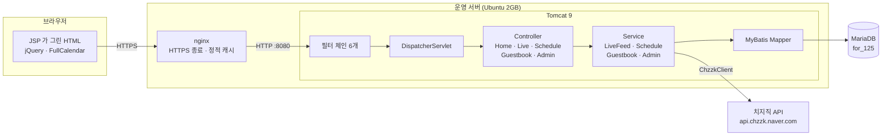
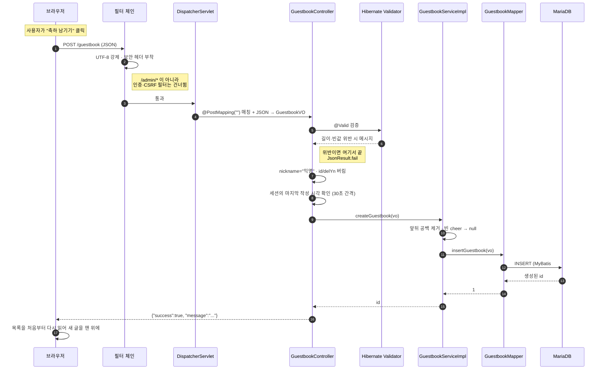
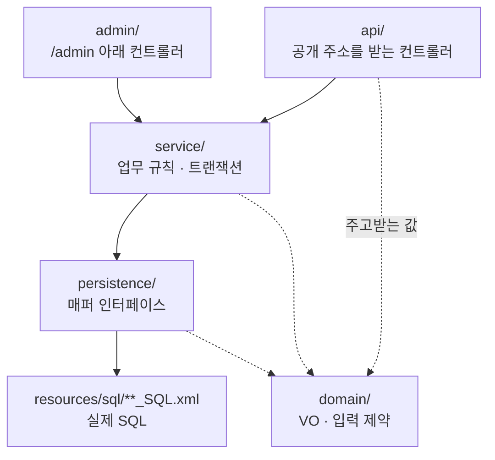
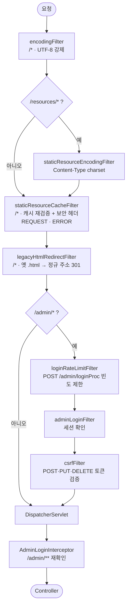
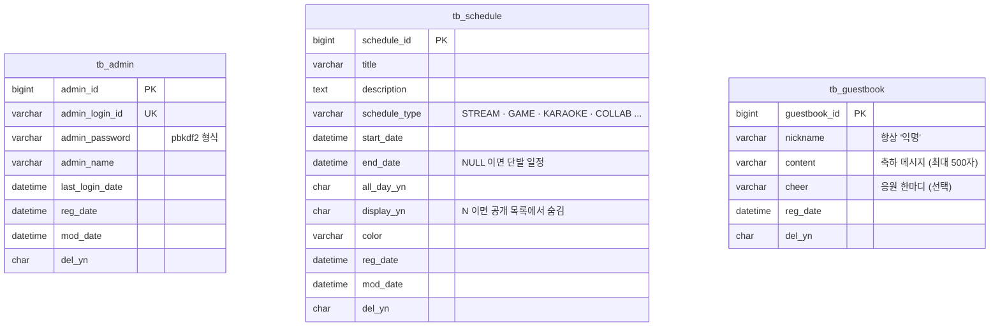
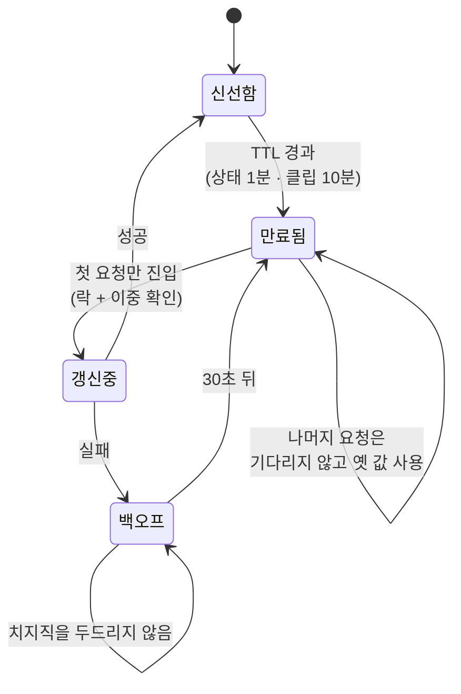

<div align="center">

# YETI-125

치지직 스트리머 이리온(IRION)의 비공식 팬사이트.
라이브 상태, 방송 일정, 클립 아카이브, 3주년 방명록을 한곳에서.

<br>

**[yeti-125.com](https://yeti-125.com)**

<br>
<br>

</div>

---

<br>

<div align="center">


</div>

<br>

## 목차

| | |
|---|---|
| [소개](#소개) · [한눈에 보기](#한눈에-보기) · [기술 스택](#기술-스택) | 이 프로젝트가 무엇인가 |
| [화면](#화면) | 사용자에게 보이는 것 |
| [전체 그림](#전체-그림) · [요청 하나가 화면이 되기까지](#요청-하나가-화면이-되기까지) | 어떻게 도는가 |
| [코드가 놓인 자리](#코드가-놓인-자리) · [새 기능을 붙이려면](#새-기능을-붙이려면) | 어디를 고치면 되는가 |
| [요청 처리 파이프라인](#요청-처리-파이프라인) · [데이터 모델](#데이터-모델) · [치지직 연동과 캐시](#치지직-연동과-캐시) | 내부 구조 |
| [디자인](#디자인) · [보안](#보안) | 설계 결정 |
| [로컬에서 실행하기](#로컬에서-실행하기) · [배포](#배포) · [데이터베이스 백업](#데이터베이스-백업) | 돌리고 올리는 법 |
| [트러블슈팅](#트러블슈팅) | 실제로 부딪힌 문제와 원인 |

<br>

## 소개

YETI-125는 치지직 스트리머 이리온의 활동을 한곳에 모아 보여주는 팬 아카이브입니다.

치지직 API와 연동해 실시간 방송 상태를 보여주고,
인기 클립과 다시보기를 자동으로 수집하며,
관리자가 직접 등록한 방송 일정을 캘린더로 제공합니다.
데뷔 3주년을 맞아 방문자가 축하 메시지를 남기는 방명록도 함께 운영합니다.

혼자 만들어 혼자 운영하는 프로젝트입니다.
그래서 "여러 사람이 붙어도 안전한 구조"보다 **한 사람이 오래 고쳐 쓰기 좋은 구조**를
우선했습니다. 이 문서도 같은 목적으로 씁니다 — 몇 달 뒤에 돌아온 자신과,
처음 이 저장소를 여는 사람이 같은 그림을 보게 하려는 것입니다.

> 순수한 팬 활동의 일환으로 제작된 비상업적 프로젝트입니다.
> 원 저작자와 직접적인 관련이 없으며, 정보 제공 및 아카이빙 목적으로만 운영됩니다.

<br>

## 한눈에 보기

| | |
|---|---|
| 서비스 주소 | <https://yeti-125.com> |
| 형태 | 서버 렌더링(JSP) + 화면 안에서 AJAX 로 갱신 |
| 페이지 수 | 공개 4개(홈 · 일정 · 프로필 · 방명록) + 관리자 2개 + 오류 2개 |
| 자바 클래스 | 33개 |
| 테스트 | JUnit 4 · 219개 (DB · 톰캣 없이 도는 순수 단위 테스트) |
| 데이터 출처 | MariaDB(일정 · 방명록 · 관리자) + 치지직 API(라이브 · 클립 · 다시보기) |
| 운영 서버 | Ubuntu 22.04 · 2GB · nginx → Tomcat 9 |
| 배포 | `./scripts/deploy.sh` 한 줄 — 실패하면 자동 롤백 |

<br>

## 기술 스택

| 영역 | |
|------|---|
| 백엔드 | Java (빌드 타깃 8 · 실행 11 이상) · Spring Framework 5.3 · MyBatis 3.5 |
| 데이터베이스 | MariaDB · HikariCP |
| 프론트엔드 | HTML5 · CSS3 · JavaScript · jQuery 3.7 |
| 라이브러리 | FullCalendar 6.1 · Jackson · Hibernate Validator |
| 테스트 | JUnit 4 (219개) |
| 외부 API | [chzzk API](https://chzzk.naver.com/) · 클립 임베드 플레이어 |
| 빌드 / 서버 | Maven · Apache Tomcat 9 |

프레임워크를 최신으로 올리지 못하는 이유가 있습니다.
Spring 6 계열은 `javax` 가 아닌 `jakarta` 네임스페이스를 요구하고,
그러면 톰캣 10 이상과 자바 17 이상으로 함께 올라가야 합니다.
2GB 서버에서 도는 팬사이트에는 지금 조합이 맞다고 보고 5.3 에 머물러 있습니다.
`pom.xml` 의 주석에 어떤 의존성이 왜 묶여 있는지 적어두었습니다.

<br>

## 화면

### 홈

실시간 방송 상태(LIVE / OFFLINE), 인기 클립과 다시보기,
채널과 SNS 링크를 한 화면에 정리합니다.

방송 중이면 라이브 히어로가, 아니면 오프라인 히어로가 그 자리에 들어갑니다.
둘 다 마크업에 있고 `index.js` 가 치지직 응답을 보고 하나만 켭니다.

클립은 카드를 누르면 치지직으로 나가지 않고 그 자리에서 재생됩니다.
치지직 공식 임베드 플레이어를 모달에 띄우는 방식이라
조회수 집계와 시청 제한은 치지직 정책을 그대로 따릅니다.
새 탭으로 열고 싶으면 `⌘`(또는 `Ctrl`)를 누른 채 클릭하면 됩니다.

다시보기는 치지직이 임베드 경로를 제공하지 않아 링크 이동입니다.
나가기 전에 어디로 가는지 알리는 확인 모달을 띄웁니다.
매번 묻는 것이 번거로우면 "다시 묻지 않기"로 끌 수 있고,
끈 뒤에는 섹션 머리말에 되돌리는 링크가 나타납니다. 선택은 기기에 기억됩니다.

목록에서 감출 다시보기는 `LiveFeedService` 의 `HIDDEN_VIDEO_NOS` 에
`videoNo` 로 적어둡니다. 제목은 바뀔 수 있지만 번호는 그대로입니다.
지우는 것이 아니라 이 사이트에서만 가리는 것이라 치지직에는 남아 있습니다.


### 방송 일정

월간 캘린더 뷰로 방송 일정을 확인합니다.
저스트 채팅, 종합게임, 노래방송, 합방 — 유형별로 색을 달리해 한눈에 구분됩니다.

일정은 치지직에서 가져오는 값이 아니라 **관리자가 손으로 넣는 데이터**입니다.
그래서 이 사이트에서 유일하게 "잃으면 되돌릴 수 없는" 자료이고,
[데이터베이스 백업](#데이터베이스-백업)이 존재하는 이유이기도 합니다.


### 프로필

캐릭터 설정, 제작 크레딧, 데뷔일과 생일 D-Day,
채널과 SNS 링크를 정돈된 형태로 제공합니다.


### 방명록

데뷔 3주년을 맞아 방문자가 축하 메시지를 남기는 페이지입니다.

**로그인도 닉네임도 없습니다.** 글쓴이 이름은 서버가 `익명` 으로 고정하고,
IP 나 기기 정보는 저장하지 않습니다. 화면에서 입력칸을 없앤 것만으로는
API 로 직접 이름을 실어 보내는 것을 막지 못하므로, 컨트롤러가 실려 온 값을
버리고 다시 씁니다 (`GuestbookControllerTest` 가 이것을 못 박습니다).

카드는 편지 모양입니다 — 위에 아카이브 번호와 날짜, 가운데 본문,
아래에 응원 한마디와 서명이 옵니다. 번호는 "몇 번째 축하인가"를 뜻해서
가장 오래된 글이 1번입니다.

관리자로 로그인한 상태로 이 페이지에 들어오면 카드마다 삭제 버튼이 나타납니다.
별도의 관리 화면을 두지 않은 이유는, 실제로 보이는 카드를 보면서 지우는 편이
목록에서 제목만 보고 지우는 것보다 실수가 적기 때문입니다.

### 관리자

방송 일정을 등록·수정·삭제하고, 캘린더에서 드래그로 옮길 수 있습니다.
좁은 화면에서는 월간 격자 대신 목록 뷰로 시작해 제목과 시간을 그대로 읽을 수 있습니다.

인증은 필터와 인터셉터 두 겹으로 봅니다.
필터가 `DispatcherServlet` 앞에서 정적 페이지까지 막고,
인터셉터가 컨트롤러 진입 직전에 한 번 더 확인합니다.
두 곳 모두 AJAX 요청에는 리다이렉트 대신 401 을 돌려줍니다.

### 인트로

홈에 처음 들어오면 문이 열리는 연출이 재생됩니다.
하루에 한 번만 보여주므로, 같은 날 다시 방문하면 바로 본문이 나옵니다.
(마지막으로 문을 연 날짜를 `localStorage` 에 두고 오늘과 비교합니다)


### 3주년 축하 연출

데뷔 3주년(2026-09-12)을 기념하는 한시적 연출입니다.
홈에 들어오면 폭죽이 3~4초 터지고 뒤이어 축하 팝업이 뜹니다.
커서를 따라다니는 반짝이와, 클릭한 자리에서 퍼지는 링도 함께 켜집니다.

폭죽은 홈에서만 터집니다.
`pages/index.jsp` 의 `<script ... data-confetti="on">` 이 스위치라
어느 페이지에서 터뜨릴지가 마크업에 드러납니다.
주소로 홈을 가려내면 컨텍스트 패스나 경로가 바뀔 때 같이 깨집니다.

팝업은 하루에 한 번입니다. 인트로와 같은 방식으로 본 날짜를 `localStorage` 에 두고
오늘과 비교합니다. 닫을 때가 아니라 뜨는 순간 기록하므로, 닫지 않고 다른 페이지로
넘어가도 그날은 다시 뜨지 않습니다.

기간은 `anniversary.js` 상단의 `SHOW_FROM` / `SHOW_TO` 가 정합니다 (2026-09-05 ~ 09-19).
이 창을 벗어나면 스크립트가 아무 일도 하지 않으므로,
기념 주간이 끝나면 사이트는 저절로 평소 모습으로 돌아갑니다.

움직임을 줄이도록 설정한 사용자(`prefers-reduced-motion`)에게는
폭죽 · 반짝이 · 클릭 이펙트를 켜지 않고 축하 인사만 띄웁니다.

### 다크모드

상단바의 토글로 전환합니다.
선택은 기기에 기억되고, 고른 적이 없으면 OS 설정을 따릅니다.

<br>

## 전체 그림

nginx가 HTTPS를 끊고 톰캣에 평문으로 넘깁니다.
방송 일정·방명록은 MariaDB에서, 라이브 상태·클립·다시보기는 치지직 API에서 옵니다.



읽어야 할 두 가지가 있습니다.

**하나 — 데이터 출처가 둘입니다.** 우리 DB 에 있는 것(일정 · 방명록 · 관리자)과
치지직에서 매번 물어야 하는 것(라이브 · 클립 · 다시보기)은 성격이 다릅니다.
앞의 것은 우리가 책임지고 백업하며, 뒤의 것은 [캐시](#치지직-연동과-캐시)로 감쌉니다.

**둘 — 화면은 두 번 그려집니다.** JSP 가 뼈대를 서버에서 그려 보내고,
브라우저가 뜬 뒤에 JS 가 AJAX 로 나머지를 채웁니다.
그래서 "페이지는 200 인데 내용이 비어 있는" 상태가 가능하고,
[배포 검증](#배포)이 페이지와 API 를 따로 확인하는 이유가 됩니다.

<br>

## 요청 하나가 화면이 되기까지

방명록에 글을 남기는 흐름을 처음부터 끝까지 따라가 봅니다.
이 프로젝트의 거의 모든 요소가 한 번씩 등장합니다.



각 단계가 어느 파일인지는 이렇습니다.

| 단계 | 파일 |
|---|---|
| 필터 체인 | `webapp/WEB-INF/web.xml` + `common/web/filter/*` |
| 주소 → 메서드 | `guestbook/api/GuestbookController.java` |
| 입력 규칙 | `guestbook/domain/GuestbookVO.java` (`@NotBlank` · `@Size`) |
| 업무 규칙 | `guestbook/service/impl/GuestbookServiceImpl.java` |
| SQL | `resources/sql/guestbook/Guestbook_SQL.xml` |
| 화면 · AJAX | `webapp/resources/js/pages/guestbook.js` |

<br>

## 코드가 놓인 자리

```
YETI-125/
├── src/
│   ├── main/
│   │   ├── java/com/irion/
│   │   │   ├── common/
│   │   │   │   ├── api/             공개 페이지 · 라이브 상태 컨트롤러
│   │   │   │   ├── web/filter/      인증 · CSRF · 빈도 제한 · 보안 헤더 · 캐시 재검증
│   │   │   │   ├── web/interceptor/ 관리자 인증 재확인
│   │   │   │   ├── service/         ChzzkClient(호출·파싱) · LiveFeedService(캐시)
│   │   │   │   └── util/            비밀번호 · CSRF 토큰 · 로그인 시도 제한 · 조회 기간
│   │   │   ├── schedule/          방송 일정
│   │   │   ├── guestbook/         3주년 방명록
│   │   │   └── admin/             관리자 인증
│   │   │       ├── api/             공개 주소를 받는 컨트롤러
│   │   │       ├── admin/           /admin 아래 컨트롤러 — 인증 필터를 타는 쪽
│   │   │       ├── domain/          VO
│   │   │       ├── persistence/     MyBatis 매퍼 인터페이스
│   │   │       └── service/         서비스 + impl
│   │   ├── resources/
│   │   │   ├── logback.xml        로그 설정 (클래스패스 최상단이어야 logback 이 찾는다)
│   │   │   ├── spring/            Spring 설정 (root-context · servlet-context)
│   │   │   ├── mybatis/           MyBatis 설정 (별칭 · camelCase 매핑)
│   │   │   ├── properties/        DB 접속 정보 (로컬)
│   │   │   └── sql/               매퍼 SQL — MyBatis 가 읽는 *_SQL.xml 만 둔다
│   │   ├── resources-prod/        DB 접속 정보 (운영) — mvn -Pprod 전용
│   │   └── webapp/
│   │       ├── META-INF/          톰캣 쿠키 처리기 (SameSite)
│   │       ├── manifest.json      홈 화면에 추가했을 때의 아이콘·이름
│   │       ├── WEB-INF/
│   │       │   ├── web.xml        필터 · 서블릿 · 세션 · 오류 페이지
│   │       │   └── views/
│   │       │       ├── pages/     홈 · 일정 · 프로필 · 방명록
│   │       │       ├── layout/    상단바 · 바닥글 · head 공통 조각 · 테마 토글
│   │       │       ├── admin/     관리자 화면
│   │       │       └── error/     404 · 500
│   │       └── resources/
│   │           ├── css/    base(공용) · pages(화면별) · features(연출)
│   │           ├── js/     core(공용) · pages(화면별) · features(연출)
│   │           └── images/ brand · cursors · profile · social
│   └── test/
│       ├── java/com/irion/
│       │   ├── testsupport/       FakeHttp — 필터·인터셉터 테스트가 쓰는 서블릿 대역
│       │   └── (본 코드와 같은 패키지 구조)
│       └── resources/             logback-test.xml — 테스트는 파일 로그를 남기지 않는다
├── .github/
│   ├── workflows/test.yml   푸시·PR 마다 mvn test
│   └── dependabot.yml       주간 의존성 감시
├── scripts/
│   ├── run-local.sh         로컬 빌드 · 배포 · 기동 확인 (맥)
│   ├── deploy.sh            테스트 · 빌드 · 전송 · 배포 · 롤백 (맥 → 서버)
│   ├── strip-comments.py    배포본 css · js 주석 제거 (mvn -Pprod 가 부른다)
│   └── db-backup.sh         DB 백업 (서버에서 cron 으로)
├── docs/
│   ├── db/schema.sql        최초 1회 실행하는 DDL — 실행 자원이 아니라 war 에 넣지 않는다
│   └── screenshots/         README 용 화면 캡처
├── deploy.env.example       배포 대상 서버 설정 예시 (실제 값은 deploy.env)
└── pom.xml
```

### 기능 폴더는 모두 같은 모양입니다

`schedule` · `guestbook` · `admin` 은 다섯 갈래를 똑같이 씁니다.



`api` 와 `admin` 을 가른 것은 취향이 아니라 **규칙**입니다.
`web.xml` 의 로그인 필터와 CSRF 필터가 `/admin/*` 에만 걸리므로,
관리자만 할 수 있어야 하는 일은 주소가 그 아래여야 합니다.
방명록 삭제를 `AdminGuestbookController` 에 따로 둔 것이 그 예입니다 —
공개 컨트롤러에 두면 화면에서 버튼을 숨기는 것 말고는 아무 방어가 없습니다.

`common` 은 성격이 달라 이 틀을 따르지 않습니다.
어느 기능에도 속하지 않는 것(필터 · 인터셉터 · 유틸 · 치지직 클라이언트)만 모읍니다.

### 어디를 고치면 되나

| 하고 싶은 일 | 볼 파일 |
|---|---|
| 화면의 글자·색을 바꾼다 | `webapp/resources/css/pages/*.css` |
| 상단바·바닥글을 바꾼다 | `webapp/WEB-INF/views/layout/*.jsp` |
| 새 주소(URL)를 연다 | 해당 기능의 `api/` 또는 `admin/` 컨트롤러 |
| SQL 을 고친다 | `resources/sql/<기능>/*_SQL.xml` |
| 입력 길이 제한을 바꾼다 | `<기능>/domain/*VO.java` 의 `@Size` (+ DB 컬럼) |
| 치지직 호출 주기를 바꾼다 | `common/service/LiveFeedService.java` 의 TTL 상수 |
| 필터 순서를 바꾼다 | `webapp/WEB-INF/web.xml` 의 `filter-mapping` 선언 순 |
| 보안 헤더를 바꾼다 | `common/web/filter/StaticResourceCacheFilter.java` |
| 3주년 연출을 끈다 | `js/features/anniversary.js` 의 `SHOW_FROM` / `SHOW_TO` |

<br>

## 새 기능을 붙이려면

방명록을 예로 들면, 만든 파일은 이 순서였습니다.

1. **테이블** — `docs/db/schema.sql` 에 `tb_guestbook` 추가
2. **VO** — `guestbook/domain/GuestbookVO.java` · 컬럼 제약을 `@Size` 로 옮겨 적음
3. **매퍼 인터페이스** — `guestbook/persistence/GuestbookMapper.java`
4. **SQL** — `resources/sql/guestbook/Guestbook_SQL.xml`
5. **서비스** — `guestbook/service/` + `impl/`
6. **컨트롤러** — 공개는 `api/`, 삭제는 `admin/`
7. **화면** — `views/pages/guestbook.jsp` + `css/pages/` + `js/pages/`
8. **테스트** — 본 코드와 같은 패키지에 4종

**설정 파일에서 고칠 곳은 한 줄뿐이었습니다.**
`mybatis-config.xml` 의 `typeAliases` 에 `com.irion.guestbook.domain` 을 더한 것.
나머지는 자동으로 잡힙니다.

```xml
<!-- root-context.xml — 새 기능도 이 규칙에 저절로 걸린다 -->
<context:component-scan base-package="com.irion"/>
<property name="mapperLocations" value="classpath:sql/**/*_SQL.xml"/>
<property name="basePackage" value="com.irion.*.persistence"/>
```

컨트롤러가 화면을 돌려줄 때는 `views/` 아래 경로를 씁니다 (`return "pages/guestbook";`).
`InternalResourceViewResolver` 가 앞에 `/WEB-INF/views/`, 뒤에 `.jsp` 를 붙입니다.

<br>

## 요청 처리 파이프라인

필터 일곱 개가 순서대로 지나갑니다. 순서는 `web.xml` 의 `filter-mapping` 선언 순입니다.

`adminLoginFilter` 가 `DispatcherServlet` **앞에서** 도는 것이 중요합니다.
정적 HTML까지 막아주는 대신, 인증 실패 응답을 이 필터가 직접 만들어야 합니다
(트러블슈팅의 "세션이 끊기면 관리자 캘린더가 에러도 없이 비는 문제" 참고).



`staticResourceCacheFilter` 만 `<dispatcher>` 를 두 개 선언합니다.
필터 기본값은 `REQUEST` 뿐이라, 그대로 두면 `<error-page>` 로 넘어가는 404·500 응답에는
이 필터가 아예 돌지 않아 **그 두 페이지만 보안 헤더 없이 나갑니다**
(트러블슈팅의 "404·500 페이지에만 보안 헤더가 붙지 않던 문제" 참고).
`<dispatcher>` 를 하나라도 쓰면 기본값이 사라지므로 `REQUEST` 를 함께 적어야 합니다.

인증 실패를 돌려주는 방식은 요청 종류에 따라 다릅니다.
AJAX에는 401 JSON을, 브라우저 요청에는 로그인 페이지 리다이렉트를 보냅니다.


<br>

## 데이터 모델

테이블은 셋이고 **서로 외래키로 엮이지 않습니다.**

일정에 작성자를 남기지 않기 때문입니다. 관리자가 한 명이라 지금은 필요가 없고,
여러 명이 되면 `tb_schedule` 에 `admin_id` 를 더하면 됩니다.
방명록은 익명이라 애초에 이어 붙일 사람이 없습니다.

삭제는 세 테이블 모두 `del_yn` 으로 표시만 하고 행은 남깁니다.
잘못 지웠을 때 `UPDATE ... SET del_yn='N'` 한 줄로 되살릴 수 있습니다.



`tb_guestbook` 만 `mod_date` 가 없습니다 — 방명록은 쓰고 나면 고치지 않습니다.
인덱스는 `(del_yn, guestbook_id)` 한 벌인데, 목록 질의가
"안 지워진 것을 최신순으로"뿐이라 걸러내기와 정렬이 그 하나에서 끝납니다.

<br>

## 치지직 연동과 캐시

방송 상태·클립·다시보기는 우리 데이터가 아니라 매번 치지직에 물어야 하는 값입니다.
호출 하나가 최대 5초(`READ_TIMEOUT`)를 쓰기 때문에 그대로 두면
방문자 수만큼 그 시간이 곱해집니다. `LiveFeedService` 가 앞에서 이것을 흡수합니다.



| 상태 | 하는 일 | 기준 |
|---|---|---|
| 캐시가 신선함 | 치지직을 부르지 않고 보관한 값을 준다 | 방송 상태 1분 · 클립/다시보기 10분 |
| 만료됨 | **한 스레드만** 갱신하러 가고 나머지는 그 결과를 나눠 쓴다 | 락 + 이중 확인 |
| 갱신 실패 | 오류 대신 **만료된 값이라도** 돌려준다 | 화면이 죽지 않게 |
| 방금 실패함 | 잠시 동안은 다시 두드리지 않는다 | 30초 (`FAILURE_BACKOFF`) |

마지막 줄이 없으면 치지직이 멈춘 동안 요청마다 락 안에서 5초를 처음부터 다시 기다립니다
(트러블슈팅의 "치지직이 멈추면 요청마다 타임아웃을 다시 기다리는 문제" 참고).

백오프는 가장 짧은 TTL(방송 상태 1분)보다 짧게 둡니다 —
복구를 알아채는 데 걸리는 시간이 정상일 때의 갱신 주기보다 늦어지면 안 되기 때문입니다.
갱신에 성공하면 실패 기록은 지웁니다.

<br>

## 디자인

파스텔 라이트 테마와 다크 테마.
하늘색을 메인으로, 분홍을 포인트로 사용합니다.

색은 전부 CSS 커스텀 프로퍼티로 관리합니다.
다크 테마는 같은 토큰 이름에 야간 값을 덮어쓰는 방식이라,
각 페이지 CSS를 건드리지 않고도 전환됩니다.
어두운 배경에서는 액센트를 한 단계 밝혀 탁해 보이지 않게 했습니다.

```
:root                      라이트 값
:root[data-theme="dark"]   다크 값 (토글로 지정)
@media (prefers-color-scheme: dark)
                           JS 가 꺼졌을 때의 폴백
```

헤더의 테마 버튼은 시스템 → 라이트 → 다크 순으로 돕니다.
시스템 상태에서는 OS 설정을 따라가며, 페이지를 켜 둔 채로
OS 모드를 바꿔도 새로고침 없이 그 자리에서 바뀝니다.
첫 페인트 전에 `theme-init.js` 가 `<head>` 에서 동기로 돌아 테마를 확정합니다 —
그러지 않으면 새로고침할 때마다 밝은 화면이 한 번 번쩍입니다.

타이포그래피는 디스플레이의 Anton과 본문의 JetBrains Mono를 대비시켜
정보의 위계를 만들었습니다. Anton 에는 한글 글리프가 없어 한글은 Noto Sans KR 로
폴백되므로, 한글이 들어가는 자리에는 처음부터 `--f-kr` 을 씁니다.

화면 전체에 옅은 그레인 텍스처를 더해 무게감을 주고,
미디어 카드는 균일한 3열로 정렬해 가독성에 집중했습니다.

기본 커서는 화살표 옆에 눈송이를 얹은 그림입니다.
테마마다 화살표 색이 뒤집히도록 라이트 · 다크 두 벌을 두고,
색과 같은 자리에서 `--cursor-1x` / `--cursor-2x` 토큰으로 바꿔 끼웁니다.
2배 화면용 64px 그림을 `image-set` 으로 함께 주고, 이를 모르는 브라우저는 32px 그림을 씁니다.
핫스팟은 화살표 끝(`1 1`)입니다.

버튼과 링크의 `cursor: pointer` 는 그대로 둡니다 —
손가락이 사라지면 "여기를 누를 수 있다"는 신호까지 같이 사라집니다.
커서가 없는 터치 기기는 `(hover: hover) and (pointer: fine)` 로 아예 제외합니다.

모바일에서는 터치 타깃을 44px 이상으로 확보하고,
입력창 글자를 16px로 두어 iOS 사파리의 자동 확대를 막았습니다.

<br>

## 보안

관리자 영역은 팬사이트 규모에 맞는 선에서 기본기를 갖춰두었습니다.

| | |
|---|---|
| 비밀번호 | PBKDF2-HMAC-SHA256 · 210,000회 반복 · 상수 시간 비교 |
| 세션 | 로그인 성공 시 세션 재발급 (세션 고정 방어) |
| 쿠키 | `HttpOnly` · `Secure` · `SameSite=Lax` |
| CSRF | 상태 변경 요청에 토큰 검증, 로그아웃은 POST |
| 무차별 대입 | 계정 기준 실패 횟수 제한 · 자동 해제 · 추적 항목 수 상한 |
| 요청 빈도 | 로그인은 주소 기준으로도 제한 — nginx `limit_req`(1차) + 필터(2차) |
| 계정 열거 | 아이디 존재 여부와 무관하게 같은 시간을 들여 응답 |
| 자원 남용 | 일정 조회 기간 상한 · 로그인 아이디 길이 상한 · 방명록 조회 개수 상한 |
| 경로 우회 | 인증 판정 전 경로 정규화 — `..` · 퍼센트 인코딩 · 역슬래시 · 중복 슬래시 · 경로 파라미터 |
| 응답 헤더 | CSP · HSTS · `X-Frame-Options` · `X-Content-Type-Options` · `Referrer-Policy` (오류 페이지 포함) |
| 외부 스크립트 | jQuery · FullCalendar 에 SRI 해시 |
| XSS | 화면에 찍는 사용자 입력은 전부 `YetiUtil.escapeHtml` 통과 |
| SQL 인젝션 | MyBatis `#{}` 바인딩만 사용 — `${}` 문자열 치환 없음 |

### 비밀번호 저장 형식

```
pbkdf2$210000$<salt>$<hash>
```

알고리즘 이름을 앞에 둡니다. 반복 횟수를 올릴 때 기존 해시를 다시 만드는 경로가
그대로 있어서, `ITERATIONS` 를 높이면 다음 로그인부터 차례로 새 값으로 바뀝니다.

알 수 없는 형식의 해시를 만나면 같은 시간을 들여 거절하고, 원인을 `ERROR` 로그로
남깁니다 — 그러지 않으면 화면에는 "비밀번호가 틀렸다"로만 보여 진짜 이유를
알아낼 방법이 없습니다.

### 계정 열거 방어

비밀번호를 몰라도 **응답 시간만 재면 아이디의 존재 여부를 알 수 있습니다.**
관리자 계정이 하나뿐이라 아이디가 드러나는 순간 표적이 확정되고,
실패 횟수 제한과 엮이면 관리자를 계속 잠가두기도 쉬워집니다.
그래서 없는 아이디에도 검증에 드는 만큼의 계산을 그대로 씁니다.

| 로그인 실패 경로 | 응답 시간 |
|---|---|
| 있는 아이디 + 틀린 비밀번호 | 197.8 ms |
| 없는 아이디 | 199.2 ms |
| 알 수 없는 형식의 해시 | 196.6 ms |

### CSP

`script-src` 에 `'unsafe-inline'` 이 없습니다.
페이지에서 인라인 `onclick` 을 전부 걷어냈기 때문입니다.
닫기 버튼 하나를 인라인으로 되돌리는 순간 이 방어가 통째로 무의미해지므로,
새 핸들러는 `data-*` 속성과 이벤트 위임으로 붙입니다.

이 규칙은 `StaticResourceCacheFilter` 가 **실제로 내보낸 응답 헤더**를 읽어 검사합니다
(`StaticResourceCacheFilterTest`). `script-src` 에 `'unsafe-inline'` 이나 `'unsafe-eval'` 이
들어오면 빌드가 깨집니다. 상수를 직접 읽지 않는 이유는, 그러면 필터가 헤더를 안 붙여도
테스트가 통과하기 때문입니다.

`SameSite` 는 Servlet 4.0 의 `<cookie-config>` 에 항목이 없어
`webapp/META-INF/context.xml` 의 톰캣 쿠키 처리기로 지정합니다.

> `Secure` 때문에 로컬 `http://localhost:8080` 에서는 관리자 로그인이
> 사파리에서 유지되지 않습니다. 크롬과 파이어폭스는 localhost 를
> 신뢰할 수 있는 출처로 보아 그대로 동작합니다.

### 방명록이 수집하는 것

방명록은 **식별 정보를 저장하지 않습니다.** 닉네임은 서버가 `익명` 으로 고정하고,
IP · User-Agent · 쿠키를 기록하는 코드가 없습니다. 남는 것은 글 내용과 작성 시각뿐입니다.

다만 웹서버 접속 로그(nginx · 톰캣)에는 다른 사이트와 마찬가지로 방문자 IP 가 남습니다.
"아무것도 수집하지 않는다"가 아니라 **"애플리케이션이 저장하지 않는다"** 가 정확한 표현입니다.

도배는 세션 기준 30초 간격으로 막습니다. 쿠키를 지우면 풀리는 임시 방편이고,
진짜 방어는 아래 nginx 요청 제한입니다.

### 의존성 취약점 감시

**자동 (키 없이 동작)** — [.github/dependabot.yml](.github/dependabot.yml)

깃허브가 매주 월요일 `pom.xml` 을 훑어 새 버전이 나오면 PR 을 열어줍니다.
패치 단위 업데이트는 한 PR 로 묶고, 지금 올릴 수 없는 것(Spring 6 계열)은 제외했습니다.

**수동 (NVD API 키 필요)** — `security` 프로파일

```bash
mvn -Psecurity verify -Dnvd.api.key=발급받은키
```

CVSS 7.0 이상이 나오면 빌드를 실패시키고, 보고서는
`target/dependency-check-report.html` 에 남습니다.
키는 <https://nvd.nist.gov/developers/request-an-api-key> 에서 무료로 받습니다.
2024년부터 익명 접근이 막혀 **키 없이는 아예 돌지 않습니다.**
기본 빌드에는 들어가지 않습니다 — NVD 데이터를 받느라 몇 분씩 걸립니다.

오탐은 [dependency-check-suppress.xml](dependency-check-suppress.xml) 에
**왜 해당되지 않는지 근거를 적어** 예외 처리합니다.

### 로그인 요청 비용 제한

`/admin/loginProc` 은 **두 겹**으로 막습니다. 그럴 이유가 있습니다.

비밀번호 해시는 일부러 느립니다(PBKDF2 210,000회). 그 느림이 공격자에게도 그대로
넘어가 **요청 한 건이 서버에서 약 280ms 의 계산**이 됩니다. `LoginAttemptGuard` 는
**아이디 기준**이라 이걸 못 막습니다 — 매번 다른 아이디를 보내면 5회 한도에 영원히
닿지 않고, 없는 아이디에도 계정 열거를 막으려고 같은 계산을 그대로 태웁니다.
공격자는 **일부러 없는 아이디만 골라 보내** 그 비용을 무한정 끌어냅니다.
게다가 이 주소는 세션 이전이라 **CSRF 검사가 면제**입니다. 올바른 설계지만,
그래서 아무 웹페이지에서나 이 주소로 POST 를 보낼 수 있습니다.

그래서 세는 기준을 아이디가 아니라 **주소**로 하나 더 둡니다.

| | 어디서 | 한도 | 막는 시점 |
|---|---|---|---|
| 1차 | nginx `limit_req` | 분당 10회 + 버스트 5 | 톰캣 스레드를 잡기 전 |
| 2차 | `LoginRateLimitFilter` | 분당 20회 | 해시 계산 앞 |

1차가 더 쌉니다. 요청이 톰캣에 닿기도 전에 잘라내기 때문입니다.
2차는 **nginx 설정이 빠졌거나 서버를 새로 세웠을 때를 위한 그물**입니다 —
서버 설정은 저장소 밖에 있어 언제든 사라질 수 있고, 사라져도 아무도 모릅니다.
한도를 일부러 nginx 보다 느슨하게 둔 이유는, 평소에 2차가 먼저 걸리면
원인을 엉뚱한 곳에서 찾게 되기 때문입니다.

#### 1차 — nginx

설정은 `config/nginx` 에 있습니다. `limit_req_zone` 은 `http` 블록에만,
`location` 은 `server` 블록에만 놓을 수 있어 파일이 둘입니다.

```bash
# 저장 영역 — conf.d 는 http 블록에서 자동으로 include 된다
sudo install -m 644 config/nginx/yeti-125-login-zone.conf /etc/nginx/conf.d/

# 적용 지점 — 사이트의 server 블록 안에서 include 한다
sudo install -m 644 config/nginx/yeti-125-login.conf /etc/nginx/snippets/
#   server { ... 안에 한 줄:
#       include snippets/yeti-125-login.conf;

sudo nginx -t && sudo systemctl reload nginx
```

정확 일치(`=`) location 이라 **기존 location 의 설정을 하나도 물려받지 않습니다.**
`proxy_set_header` 를 그 블록에 다시 적어야 합니다. 특히 `X-Forwarded-For` 를
빠뜨리면 톰캣이 요청자 주소를 알 수 없게 되고, 2차가 **모든 요청을 한 통에 담아**
정작 관리자가 못 들어옵니다.

#### 2차 — LoginRateLimitFilter

`common/web/filter/LoginRateLimitFilter.java` 가 `POST /admin/loginProc` 만 셉니다.
한도를 넘으면 `429` 와 `Retry-After` 를 주고 **거기서 끊습니다** — 컨트롤러까지
들어가면 이미 해시를 계산한 뒤라 늦습니다. 컨트롤러가 아니라 필터인 이유입니다.

주소는 `RequestUtil.clientIp()` 가 정합니다. 헤더는 보낸 쪽이 마음대로 적을 수 있어
그냥 믿으면 제한이 무의미해지므로, 두 가지만 믿습니다.

1. **루프백에서 온 요청** — 앞단 nginx 가 넘긴 것입니다. 이때만 `X-Forwarded-For` 를 봅니다.
2. **그 헤더의 마지막 값** — nginx 의 `$proxy_add_x_forwarded_for` 는 자기가 본 주소를
   뒤에 덧붙입니다. 앞쪽은 지어낸 값일 수 있어도 마지막은 아닙니다.

톰캣에 직접 닿은 요청은 헤더를 아예 보지 않습니다.

경로는 `RequestUtil.normalizedPath()` 로 판정합니다.
원본 주소로 보면 `/admin/schedule/../loginProc` 이 이 검사를 비켜 갑니다.

기록은 주소당 항목 하나이고 상한이 10,000개입니다. 창이 끝난 항목부터 치우고,
그래도 자리가 없으면 통과시키지 않습니다 — 상한이 곧 우회로가 되면 안 됩니다.

막힌 요청은 로그에 남지만 **1분에 한 줄까지만** 남깁니다.
막히기 시작하면 계속 막히므로, 한 줄씩 남기면 공격이 곧 로그 폭탄이 됩니다.
주소는 마지막 자리를 가려 적습니다(`1.2.3.x`) — 계정 이름을 가리는 것과 같은 이유입니다.

확인은 이렇게 합니다. 21번째부터 `429` 가 나와야 합니다.

```bash
for i in $(seq 1 21); do
  printf '%s ' "$(curl -s -o /dev/null -w '%{http_code}' \
      -X POST -d 'adminLoginId=x&password=y' https://yeti-125.com/admin/loginProc)"
done
```

<br>

## 로컬에서 실행하기

**JDK 11 이상**, Maven 3.6 이상, MariaDB 10 이상, Apache Tomcat 9 이상이 필요합니다.

바이트코드는 자바 8 타깃으로 컴파일되지만, 실행 환경은 자바 11 이상이어야 합니다.
톰캣이 JSP 를 실행 중에 컴파일할 때 쓰는 ECJ 가 11 이상을 요구하기 때문입니다
(자바 8 서버에 올리면 모든 페이지가 500 이 됩니다 —
[트러블슈팅](#자바-8-서버에서-모든-페이지가-500-이-되는-문제) 참고).
`scripts/deploy.sh` 는 배포 전에 서버 자바 버전을 확인하고 11 미만이면 중단합니다.

#### 1. 저장소 클론

```bash
git clone https://github.com/sooindev/YETI-125.git
cd YETI-125
```

#### 2. 데이터베이스 준비

`docs/db/schema.sql` 을 실행해 `for_125` 데이터베이스와
`tb_admin` · `tb_schedule` · `tb_guestbook` 테이블을 생성합니다.

```bash
mysql -u root -p < docs/db/schema.sql
```

앱이 쓸 계정은 따로 만듭니다. 스키마 파일은 테이블만 만들고 계정은 만들지 않습니다.

```sql
CREATE USER 'yeti'@'localhost' IDENTIFIED BY '비밀번호';
GRANT SELECT, INSERT, UPDATE, DELETE ON for_125.* TO 'yeti'@'localhost';
```

관리자 계정도 `tb_admin` 에 직접 넣어야 합니다.
`tb_admin` 은 비어 있는 채로 만들어지고, 계정을 심는 스크립트는 없습니다.
비밀번호 해시는 `PasswordUtil` 이 만들어 줍니다.

```bash
mvn -q clean compile
mvn -q dependency:build-classpath -Dmdep.outputFile=/tmp/yeti-cp.txt
java -cp "target/classes:$(cat /tmp/yeti-cp.txt)" com.irion.common.util.PasswordUtil "비밀번호"
```

출력된 값을 그대로 넣습니다.

```sql
INSERT INTO tb_admin (admin_login_id, admin_password, admin_name)
VALUES ('아이디', 'pbkdf2$210000$...$...', '관리자');
```

#### 3. 접속 정보 설정

`src/main/resources/properties/database.properties` 에서 계정 정보를 수정합니다.
이 파일은 `.gitignore` 대상이라 저장소에 포함되지 않습니다.

```properties
db.driver=org.mariadb.jdbc.Driver
db.url=jdbc:mariadb://localhost:3306/for_125?useUnicode=true&characterEncoding=UTF-8&serverTimezone=Asia/Seoul
DB_USERNAME=your_username
DB_PASSWORD=your_password
```

#### 4. 빌드와 실행

```bash
mvn clean package
cp target/*.war $TOMCAT_HOME/webapps/ROOT.war
$TOMCAT_HOME/bin/startup.sh
```

HTML이 `/resources/...` 절대경로를 사용하므로 **ROOT 컨텍스트로 배포해야 합니다.**
`yeti-125.war` 그대로 두면 CSS와 JS가 404가 됩니다.

macOS에서는 위 과정을 스크립트 하나로 대신할 수 있습니다.
빌드 → 로컬 톰캣에 ROOT로 배포 → DB 연동까지 확인합니다.

```bash
./scripts/run-local.sh
./scripts/run-local.sh --skip-build   # 빌드 없이 재배포
./scripts/run-local.sh --stop         # 정지
./scripts/run-local.sh --logs         # catalina.out 실시간 보기
```

DB 비밀번호는 스크립트에 두지 않습니다.
`~/.my.cnf` 의 `[client]` 섹션을 읽거나 `YETI_DB_PASSWORD` 환경변수를 받습니다.

```ini
[client]
password="비밀번호"
```

`my.cnf` 에서 `#` 는 주석 시작 문자입니다. 비밀번호에 `#` 가 들어 있으면
거기서 잘린 채 읽혀 원인을 짐작하기 어려운 `Access denied` 가 납니다.
값은 큰따옴표로 감싸세요. `user=` 는 넣지 않습니다 —
`[client]` 는 모든 mariadb 클라이언트에 적용되어 소켓 인증까지 끌려갑니다.

> `mvn -Pprod` 로 빌드하면 `target/classes` 의 DB 설정이 **운영 값으로 덮여 남습니다.**
> 그 뒤 IDE 로 로컬 실행하면 운영 비밀번호로 로컬 DB 에 붙으려다 `Access denied` 가 납니다.
> `mvn clean package`(prod 아님)를 한 번 돌리면 되돌아옵니다.
> `run-local.sh` 는 prod 없이 빌드하므로 스스로 복구됩니다.

#### 5. 테스트

```bash
mvn test
```

DB 도 톰캣도 필요 없습니다 — 스프링 컨텍스트를 띄우지 않고,
매퍼·서비스·서블릿을 가짜 객체로 갈아 끼워 순수 자바로만 돕니다.
`main` 에 올리거나 PR 을 열면 깃허브 액션이 같은 테스트를 자동으로 돌립니다
(`.github/workflows/test.yml`).

#### 6. 접속

| | |
|---|---|
| 메인 사이트 | `http://localhost:8080` |
| 방명록 | `http://localhost:8080/guestbook` |
| 관리자 | `http://localhost:8080/admin/admin-login` |

<br>

## 배포

### 왜 프로파일을 나눴나

`database.properties` 는 classpath 리소스라 **war 안에 그대로 패키징됩니다.**
로컬 설정이 담긴 war를 운영에 올리면 DB 연결에 실패해 사이트가 내려갑니다.

운영 설정은 `src/main/resources-prod/properties/database.properties` 에 두고,
`prod` 프로파일로 빌드할 때만 덮어씁니다. 이 파일 역시 `.gitignore` 대상입니다.

```bash
mvn clean package          # 로컬 개발용
mvn clean package -Pprod   # 운영 배포용
```

운영 설정이 채워지지 않았거나 주소가 로컬을 가리키면 **빌드 단계에서 중단됩니다.**

배포 대상 서버 주소도 저장소에 두지 않습니다 — 공개 저장소이기 때문입니다.

```bash
cp deploy.env.example deploy.env
# YETI_DEPLOY_SERVER=사용자@서버주소
```

### 배포 한 줄

```bash
./scripts/deploy.sh
./scripts/deploy.sh --skip-tests   # 급할 때만
```

테스트 → 빌드 → 서버 자바 확인 → 전송 → 교체 → 검증 순으로 진행하고,
검증에 실패하면 직전 백업으로 자동 롤백합니다.


### 헬스체크가 보는 것

검증은 정상 페이지 다섯 곳과 DB 연동 API 두 곳이 200 인지 보고,
**없는 주소가 404 를 주는지와 그 응답에 보안 헤더가 붙어 있는지**도 함께 봅니다.

상태 코드만 보면 안 됩니다 — 톰캣만 뜨고 앱이 아직 안 붙은 순간에도 404 는 나오기 때문에,
헤더까지 확인해야 "우리 오류 화면이 우리 필터를 타고 나왔다"가 증명됩니다.

방명록은 페이지(`/guestbook`)와 목록 API(`/guestbook/list`)를 둘 다 봅니다.
페이지는 화면만 그리고 글은 브라우저가 API 로 따로 받아 가기 때문에,
테이블이 없거나 앱 계정에 권한이 없어도 페이지 자체는 200 입니다 — 페이지만 보면 그냥 통과합니다.

### 배포본에서 주석 걷어내기

`css` · `js` 의 주석은 그대로 두면 브라우저에서 읽힙니다.
`prod` 빌드는 `src/main/webapp` 을 `target/webapp-prod` 로 복사한 뒤
**그 사본에서만** 주석을 걷어내고 사본으로 war 를 쌉니다.
저장소의 주석은 남고 배포본에서만 빠집니다.
war 플러그인의 `webResources` 겹치기 순서에 기대지 않으려고
사본을 `warSourceDirectory` 로 통째로 지정했습니다.

걷어내는 일은 `scripts/strip-comments.py` 가 맡습니다.
정규식으로 자르지 않습니다 — 문자열이나 정규식 리터럴 안의 슬래시까지 주석으로 보고
잘라 코드를 깨뜨립니다. 문자열 · 템플릿 · 정규식 상태를 따라가는 스캐너로 훑습니다.

JSP 의 `<!-- -->` 는 브라우저로 그대로 나갑니다.
페이지 주석은 전부 `<%-- --%>` 로 적습니다 — 서버에서 걷혀 응답에 실리지 않습니다.

빌드 장비에 `python3` 가 필요합니다.
없으면 주석이 남은 채 배포되지 않도록 빌드를 세웁니다. (CI 는 `mvn test` 만 돌아 해당 없습니다)

코드 자체를 감추는 것은 아닙니다.
브라우저가 받아 실행하는 파일이라 로직은 그대로 보입니다. 걷어내는 것은 설명뿐입니다.

<br>

## 데이터베이스 백업

운영 서버에서 `scripts/db-backup.sh` 가 cron 으로 돕니다.
일정과 방명록은 되돌릴 방법이 없는 자료입니다.

| | |
|---|---|
| 설치 위치 | `/usr/local/sbin/yeti-db-backup.sh` |
| 보관 위치 | `/var/backups/yeti-125` (권한 600) |
| 로그 | `/var/log/yeti-db-backup.log` |
| 보관 개수 | 14개 — 넘으면 오래된 것부터 지웁니다 |

```bash
sudo install -m 700 scripts/db-backup.sh /usr/local/sbin/yeti-db-backup.sh
sudo crontab -e
# 매일 새벽 4시
0 4 * * * /usr/local/sbin/yeti-db-backup.sh >> /var/log/yeti-db-backup.log 2>&1
```

스크립트에 비밀번호가 없습니다.
우분투의 MariaDB `root` 는 `unix_socket` 인증이라 root 로 실행하면 그냥 붙습니다.

덤프는 `--single-transaction` 으로 InnoDB 를 잠그지 않고 일관된 시점을 뜨고,
`--quick` 으로 한 행씩 흘려보냅니다 (2GB 서버라 메모리를 아껴야 합니다).

**중간에 끊긴 덤프가 정상 백업인 척 남지 않도록** 먼저 `.part` 로 쓰고,
`gzip -t` 로 압축이 온전한지 확인한 뒤에만 정식 이름으로 바꿉니다.

복구는 이렇게 합니다.

```bash
gunzip -c /var/backups/yeti-125/for_125-20260826-040001.sql.gz | mysql for_125
```

<br>

## 트러블슈팅

#### 일정 시간이 9시간씩 밀려 저장되는 문제

관리자에서 오전 8시로 등록한 일정이 DB에는 오후 5시로 저장되었습니다.
입력한 모든 시각이 정확히 9시간씩 어긋났습니다.

원인은 타임존 변환의 중복이었습니다.
프론트엔드가 오프셋(KST +9h)을 더해 UTC 형식으로 보냈고,
백엔드 `ScheduleVO`가 그 값을 다시 UTC 기준으로 해석하면서
KST 시각에 9시간이 한 번 더 더해진 것입니다.

변환 지점을 하나로 모았습니다.
프론트는 `datetime-local` 입력값을 변환 없이 그대로 보내고,
백엔드의 `@JsonFormat`을 `Asia/Seoul` 기준으로 해석하도록 변경했습니다.
입력·저장·표시 전 구간이 KST로 일관되게 맞춰졌습니다.

#### 직접 만든 JSON 파서가 제목을 잘라먹는 문제

인기 클립의 썸네일 자리에 이미지 대신 제목이 나오거나,
제목이 중간에서 끊겨 표시되었습니다.

chzzk 응답을 `indexOf` 로 잘라 읽는 파서를 직접 두고 있었습니다.
문자열의 끝을 다음 `"` 로 찾는 방식이라 JSON 이스케이프를 모릅니다.

```
입력   {"clipTitle":"이리온 \"레전드\" 순간"}
결과   이리온 \
```

괄호 매칭에 escape 판정을 덧대며 한동안 버텼지만,
`\n` · `\\` · `\/` 가 디코드되지 않는 등 같은 종류의 문제가 계속 나왔습니다.
JSON 을 직접 파싱하려 한 것 자체가 원인이었습니다.

이미 의존성에 있던 Jackson 으로 교체하고 손으로 만든 파서 120줄을 걷어냈습니다.
같은 작업에서 치지직 호출·파싱을 `ChzzkClient` 로, 캐시를 `LiveFeedService` 로
분리해 컨트롤러에는 HTTP 처리만 남겼습니다 (602줄 → 92줄).
회귀를 막으려고 위 입력을 그대로 테스트로 고정해두었습니다.

#### 페이지 스크롤이 중간에 멈추는 문제

리뉴얼 직후 일부 페이지에서 본문 중간까지만 스크롤되고 더 내려가지 않았습니다.

`body`에 가로 스크롤을 막으려고 `overflow-x: hidden`을 지정했는데,
CSS 명세상 한 축에 `hidden`을 주면 다른 축의 `overflow`가 자동으로 `auto`로 승격됩니다.
그 결과 `body`가 별도 스크롤 컨테이너가 되어 문서 스크롤과 충돌했습니다.

`overflow-x: hidden`을 `body`에서 `html`로 옮겨,
`body`는 일반 문서 흐름을 유지하도록 했습니다.

#### 배포 직후 사이트 전체가 응답하지 않는 문제

새 war를 올린 뒤 정적 페이지는 열리는데 DB를 읽는 요청마다 실패했습니다.
데이터가 지워진 것처럼 보였지만, 실제로는 연결 대상이 잘못돼 있었습니다.

`database.properties` 는 classpath 리소스라 빌드 시 war 안에 함께 들어갑니다.
로컬 개발 설정이 담긴 채로 패키징된 war가 배포되면서,
운영 서버가 존재하지 않는 로컬 주소로 접속을 시도한 것입니다.

빌드 프로파일을 분리해 운영 설정을 별도 디렉터리에서 주입하도록 했습니다.
설정이 비어 있거나 주소가 로컬이면 빌드 자체가 실패하므로,
잘못된 war가 만들어지지 않습니다.

#### 500 오류가 404 빈 화면으로 표시되는 문제

위 장애를 추적할 때 원인 파악이 늦어진 이유입니다.
`web.xml` 이 오류 페이지를 `/WEB-INF/views/common/500.jsp` 로 지정하고 있었는데
해당 파일이 없었습니다.

500이 발생하면 없는 페이지로 포워딩되고, 그 과정에서 404가 반환되며
본문이 비어 있어 원래 오류가 완전히 가려집니다.

404 · 500 페이지를 실제로 만들어 채웠습니다.

#### 자바 8 서버에서 모든 페이지가 500 이 되는 문제

war 는 정상이고 API 도 응답하는데, 브라우저로 여는 페이지마다 500 이 났습니다.

JSP 는 미리 컴파일되지 않고 첫 요청 때 톰캣이 컴파일합니다.
톰캣 9 가 그 일에 쓰는 ECJ 가 자바 11 이상을 요구해서,
자바 8 서버에서는 JSP 가 하나도 컴파일되지 않았습니다.
`/schedule/list` 같은 JSON API 는 JSP 를 거치지 않아 멀쩡히 200 을 돌려줬고,
그래서 헬스체크는 통과하는데 사이트는 죽어 있는 상태가 됐습니다.

배포 스크립트에 두 가지를 넣었습니다.
전송 전에 서버 자바 버전을 읽어 11 미만이면 배포를 중단하고,
헬스체크는 API 하나가 아니라 실제 페이지(`/` · `/schedule` · `/info` · `/admin/admin-login`)까지
함께 확인합니다. 하나라도 200 이 아니면 직전 백업으로 롤백합니다.

#### 수정한 CSS·JS가 반영되지 않는 문제

파일을 고치고 새로고침해도 예전 화면이 그대로 보였습니다.
강제 새로고침(`⌘⇧R`)을 해야만 반영되었습니다.

톰캣이 정적 파일에 `Last-Modified` 만 보내고 `Cache-Control` 을 보내지 않아,
브라우저가 자체 휴리스틱으로 캐시 유효기간을 정한 탓입니다.
배포 후 기존 방문자가 새 HTML과 예전 CSS를 섞어 받는 문제로도 이어집니다.

`StaticResourceCacheFilter` 를 추가해 `.html` · `.css` · `.js` 에
`Cache-Control: no-cache` 를 지정했습니다.
변경이 없으면 304만 오가므로 대역폭 부담은 거의 없습니다.

확장자로만 거르면 `/schedule` 처럼 확장자 없는 페이지 주소가 빠져나가
이 필터가 무의미해집니다. 마지막 `/` 뒤에 `.` 이 없으면 페이지 주소로 봅니다.

#### 404·500 페이지에만 보안 헤더가 붙지 않던 문제

응답 헤더를 훑어보다 발견했습니다. 모든 페이지에 CSP·`X-Frame-Options`·HSTS 가
붙는데 오류 페이지 둘만 하나도 없었습니다. 필터 코드에는 조건 분기가 없었고
`web.xml` 의 매핑도 `/*` 라 안 걸릴 이유가 없어 보였습니다.

서블릿 명세 때문입니다. `filter-mapping` 에 `<dispatcher>` 를 적지 않으면
기본값은 `REQUEST` **하나뿐**입니다. `<error-page>` 로 넘어가는 응답은
`ERROR` 디스패치라서 필터 체인을 다시 타지 않습니다.
매핑이 `/*` 든 아니든 상관이 없었던 것입니다.

하필 `500.jsp` 는 바깥에서 온 주소(`javax.servlet.error.request_uri`)를
"다시 시도" 링크로 되심는 페이지입니다. 그쪽에서도 `//` 를 막고 이스케이프하지만,
겹겹이 두는 것이 이 필터의 존재 이유입니다.

```xml
<filter-mapping>
  <filter-name>staticResourceCacheFilter</filter-name>
  <url-pattern>/*</url-pattern>
  <dispatcher>REQUEST</dispatcher>   <!-- 적는 순간 기본값이 사라진다 -->
  <dispatcher>ERROR</dispatcher>
</filter-mapping>
```

`REQUEST` 를 같이 적는 것이 중요합니다. `ERROR` 만 적으면 정반대로
**일반 요청에서** 헤더가 사라집니다.

설정 파일의 문제라 코드로는 드러나지 않습니다.
`StaticResourceCacheFilterTest` 가 `web.xml` 을 직접 읽어 두 선언이 남아 있는지 확인합니다
(`servlet-context.xml` 과 VO 를 대조하는 `ScheduleVOJsonFormatTest` 와 같은 방식입니다).

#### 다시보기는 임베드되지 않는 문제

클립과 같은 방식으로 다시보기도 사이트 안에서 재생하려 했으나 되지 않았습니다.
`/embed/video/{videoNo}` 를 `iframe` 에 넣으면 플레이어 대신
치지직의 "존재하지 않는 채널입니다" 화면이 나옵니다.

치지직 프론트엔드 번들의 라우터를 확인해보니
임베드 경로는 `/embed/clip/:clipUID` 와 `/embed/clip-donation/:clipUID` 둘뿐입니다.
VOD용 경로 자체가 없어서, 라우터에 걸리지 않고 SPA의 404로 떨어진 것입니다.
`X-Frame-Options` 나 CSP `frame-ancestors` 로 막는 방식이 아니라
(치지직은 이 헤더들을 아예 보내지 않습니다) 경로가 존재하지 않는 쪽입니다.

치지직이 임베드를 열어둔 범위가 클립까지라고 보고,
다시보기는 기존의 링크 이동을 유지했습니다.

#### 19금 방송·다시보기의 썸네일이 깨지는 문제

연령 제한이 걸린 다시보기 카드와 방송 중 히어로에서
썸네일 자리에 깨진 이미지 아이콘이 떴습니다.

치지직 응답을 직접 받아보니 그 항목만 `"adult": true` 이면서
`thumbnailImageUrl` 이 `null` 입니다 (생방송은 `liveImageUrl` 이 `null`).
로그인 쿠키 없이 부르는 공개 API 라 이미지 주소를 아예 내려주지 않습니다.

`ChzzkClient.text()` 는 없는 값을 빈 문자열로 바꾸므로
화면에는 `` 가 그려집니다. 빈 `src` 는 "이미지 없음" 이 아니라
현재 페이지 주소로 해석되어, 브라우저가 HTML 을 이미지로 받아보려다 실패합니다.
깨진 아이콘은 그 실패의 표시였습니다.

주소를 되찾을 방법은 없으니 (성인 인증된 세션이라야 내려옵니다)
없는 것을 없다고 보여주기로 했습니다. `adult` 플래그를 화면까지 내려보내고,
주소가 없으면 `img` 자체를 만들지 않은 채 `.thumb-fallback` 자리를 그립니다.
19금이면 배지로 이유까지 밝힙니다.

#### 일정 조회의 기간 조건이 아무것도 거르지 않던 문제

캘린더가 보내는 `start`/`end` 와 무관하게 항상 같은 결과가 돌아왔습니다.
이틀치를 물어도, 아예 겹치지 않는 이듬해를 물어도 73건 전부였습니다.

```sql
AND start_date <= #{endDate}
AND (end_date >= #{startDate} OR end_date IS NULL)   -- 여기
```

`end_date` 는 NULL 을 허용합니다(단발 일정). SQL 에서 NULL 비교는 참이 아니라
NULL 이라 그냥 두면 단발 일정이 한 건도 안 나오는데, 그걸 살리려고 붙인
`OR end_date IS NULL` 이 너무 넓었습니다. **"종료일이 없으면 무조건 통과"**가 되어
그 일정의 시작일을 아예 보지 않습니다. 하한이 사라진 셈이라 상한
(`start_date <= endDate`)만 남고, 과거 일정은 전부 그걸 만족합니다.
운영 데이터는 73건이 전부 종료일 없는 일정이라 한 건도 걸러지지 않았습니다.

화면에는 드러나지 않았습니다. FullCalendar 가 일정을 각자 제 날짜에 그리니
보고 있는 달에는 남는 것이 안 보이고, 홈의 "다음 방송"과 "다가오는 일정"은
브라우저에서 미래 것만 다시 골라내 결과가 맞았습니다.

문제는 `DateRange` 의 400일 상한이 같이 무의미해진다는 것입니다. 그 상한을
둔 이유가 "테이블 전체를 훑지 않게" 인데, 이 구멍이 그걸 그대로 우회합니다.

```sql
AND COALESCE(end_date, start_date) >= #{startDate}
```

종료일이 없으면 시작일을 끝으로 봅니다 — 단발 일정은 그 한 점만 차지합니다.
`ScheduleSqlTest` 가 두 조회 문장 모두에 상한과 하한이 살아 있는지,
`end_date IS NULL` 이 다시 들어오지 않는지 확인합니다.

#### 관리자 인증 필터가 주소의 세미콜론 하나로 열리던 문제

`/admin;x=1/schedule` 로 요청하면 `AdminLoginFilter` 가 로그인 검사를
건너뛰고 그대로 통과시켰습니다. `/admin` 정확히 일치도 마찬가지였습니다.

톰캣은 필터를 고를 때 경로 파라미터(`;` 부터 다음 `/` 까지)를 떼고
`/admin/schedule` 로 봅니다. 스프링도 `UrlPathHelper` 가 같은 일을 해서
관리자 컨트롤러로 보냅니다. 그런데 `getRequestURI()` 만 `;x=1` 을 그대로
들고 있어서, `RequestUtil.normalizedPath()` 의 결과가 `/admin/` 으로
시작하지 않는 것처럼 보였습니다. 조건이 거짓이 되니 검사 자체를 건너뜁니다.

`..` · `%2F` · `\` · `//` 는 이미 정규화하고 테스트도 있었는데,
경로 파라미터만 빠져 있었습니다.

실제로 뚫리지는 않았습니다. `AdminLoginInterceptor` 가 경로와 무관하게
세션을 확인하고, 그쪽 `/admin/**` 매핑은 스프링이 떼어낸 경로를 쓰기
때문에 거기서 막힙니다. 그래도 일부러 두 겹으로 둔 방어 중 한 겹이
죽어 있는 상태였습니다 — 나중에 인터셉터를 중복이라 여겨 걷어내거나,
인터셉터가 닿지 않는 관리자 주소가 하나 생기면 그때 진짜로 뚫립니다.

`normalizedPath()` 가 세그먼트마다 경로 파라미터를 떼도록 고쳤습니다.
**떼는 시점은 디코딩보다 앞입니다** — 톰캣이 그 순서라서, 뒤에 떼면
`%3B` 로 보낸 진짜 세미콜론까지 잘려 이번엔 반대 방향으로 어긋납니다.
`/admin` 정확히 일치도 관리자 영역으로 함께 묶었습니다.

#### 클립 더보기가 20개에서 멈추는 문제

더보기를 눌러도 클립이 스무 개를 넘지 않았습니다.
코드는 열 페이지를 돌며 최대 100개를 모으도록 짜여 있었는데도 그랬습니다.

chzzk 의 클립 페이징은 offset 이 아니라 커서입니다.
응답의 `page.next` 에 `clipUID` 와 `readCount` 가 함께 담겨 오고,
**두 값을 같은 이름의 파라미터로 되돌려줘야** 다음 묶음이 옵니다.
기존 구현은 `next` 라는 이름으로 `clipUID` 만 보냈습니다.
chzzk 은 모르는 파라미터를 조용히 무시하고 1페이지를 다시 줬고,
중복을 걸러내고 나면 늘 스무 개였습니다.
열 번 호출해 같은 스무 개를 열 번 받고 있었던 셈입니다.

커서를 `clipUID` + `readCount` 로 바로잡고, 미리 다 받는 대신
더보기가 요구하는 만큼만 이어 받아 캐시 뒤에 붙이도록 바꿨습니다.
목록이 자랄 때 적재 시각을 새로 찍어, 한참 넘겨보는 중에 TTL 이
끝나 목록이 처음부터 다시 쌓이는 일도 막았습니다.
메모리 상한과 요청당 외부 호출 횟수, 커서가 돌지 않을 때의 중단 조건을 함께 뒀습니다.

같은 자리에서 `paginate()` 의 경계 버그도 고쳤습니다.
`offset` 이 목록 길이를 넘으면 `subList` 가 예외를 던져
`/live/clips?offset=99999` 같은 요청이 500 이 됩니다.

정리된 흐름은 다음과 같습니다.
외부 호출은 락 밖에서 하고, 합치는 순간에만 락을 잡습니다.
한 스레드가 최대 10회 × 5초 동안 락을 쥔 채 나머지 요청을 세워두는 일을 막기 위해서입니다.


#### 치지직이 멈추면 요청마다 타임아웃을 다시 기다리는 문제

치지직이 응답하지 않는 동안 사이트 전체가 느려졌습니다.
캐시는 만료된 값으로 물러나도록 돼 있어서 화면이 죽지는 않았는데,
응답이 오기까지 몇 초씩 걸렸습니다.

`LiveFeedService.cached()` 가 **실패를 기억하지 않는 것**이 원인이었습니다.
성공하면 값과 적재 시각을 남기지만, 실패하면 만료된 값을 돌려주고 아무것도 적지 않습니다.
그래서 다음 요청은 여전히 "만료됨" 상태를 보고 락을 잡은 뒤
5초 타임아웃을 처음부터 다시 기다립니다. 요청이 몰리면 그 5초가 줄줄이 직렬로 쌓입니다.

`Snapshot` 에 `failedAt` 을 더해 값·적재 시각·실패 시각을 한 객체에 담았습니다.
"값과 시각을 따로 두면 새 값 + 옛 시각 조합이 보인다"는 이유가 실패 시각에도 그대로 적용됩니다.

**락 안에서도 백오프를 보는 것이 핵심입니다.** 이미 락 앞에 줄 서 있던 스레드들이
첫 스레드의 실패를 보고 그 자리에서 물러나야 합니다. 락 밖에서만 확인하면
줄 서 있던 것들은 그대로 통과해 각자 타임아웃을 기다립니다.

값은 버리지 않습니다. 버리면 백오프 30초 동안 화면이 빕니다.

같은 조건(동시 20건 · 타임아웃 대역 200ms)에서 3회씩 측정한 결과입니다.

| | 외부 호출 | 벽시계 시간 |
|---|---|---|
| 고치기 전 | 20회 | 4073 · 4063 · 4080 ms |
| 고친 뒤 | **1회** | **206 · 206 · 207 ms** |

이 클래스는 테스트가 없었기 때문에 백오프를 넣기 **전에** 먼저 붙였습니다.
TTL 이 1~10분이라 기다릴 수 없어, `Snapshot` 의 적재 시각만 과거로 돌리는
리플렉션 헬퍼로 만료를 만듭니다.

한 가지가 함께 바뀌었습니다. 치지직이 죽어 목록이 비면 예전에는 다음 요청이
곧바로 다시 시도했는데, 이제 30초 동안은 두드리지 않습니다.
**빈 목록이 TTL 10분 내내 굳지 않는다는 성질은 그대로입니다** — 기다리는 시간이 30초로 바뀐 것뿐입니다.

#### hidden 속성을 붙였는데 계속 보이는 문제

"이동 확인 다시 켜기" 링크를 `hidden` 으로 감췄는데도 화면에 남았습니다.
JS 로 속성을 붙이고 떼는 것은 정상이었습니다.

`hidden` 은 브라우저 기본 스타일시트의 `[hidden] { display: none }` 으로
동작합니다. 기본 스타일시트는 작성자 CSS 보다 우선순위가 낮아서,
그 요소에 `display` 를 지정하는 순간 숨김이 풀립니다.

`.aside-restore[hidden] { display: none; }` 로 명시적으로 다시 눌렀습니다.

#### 모달을 닫아도 클립 소리가 계속 나는 문제

클립 모달을 닫았는데 재생 중이던 소리가 멈추지 않았습니다.

`common.js` 의 공용 모달 로직은 배경 클릭과 ESC에 `.active` 클래스만 떼어냅니다.
화면에서 사라질 뿐 `iframe` 은 DOM에 그대로 남아 안쪽 플레이어가 계속 돕니다.
닫기 버튼만 따로 처리해서는 나머지 두 경로가 새어 나갑니다.

세 경로 모두에서 `iframe` 의 `src` 를 비우도록 했습니다.
`src` 를 지우면 문서 자체가 내려가므로 재생이 확실히 멈춥니다.

#### 모달 안에서 날짜 입력창이 밖으로 삐져나가는 문제

관리자 일정 등록 모달의 `datetime-local` 입력창이 모달 폭을 넘어
가로 스크롤이 생겼습니다. 입력창에 `width: 100%` 가 이미 지정돼 있었는데도
줄어들지 않았습니다.

입력창이 아니라 그리드 트랙이 원인이었습니다.
`datetime-local` 은 내부 UI 때문에 최소 폭이 크고,
`1fr` 트랙은 내용의 max-content 폭까지 늘어납니다.

`grid-template-columns` 를 `minmax(0, 1fr)` 로 바꿔 트랙을 묶었습니다.

#### 제목에 `'` 가 든 일정을 눌러도 아무 반응이 없는 문제

"다가오는 일정" 카드 중 일부만 클릭이 먹지 않았습니다.
콘솔에는 `SyntaxError` 만 찍혔습니다.

카드를 인라인 `onclick` 으로 만들면서 값에 `escapeHtml()` 을 통과시킨 것이
원인이었습니다. `escapeHtml` 은 `'` 를 `&#039;` 로 바꾸지만,
브라우저는 속성값을 **HTML 디코드한 뒤에** JS 로 파싱합니다.
그 시점에 아포스트로피가 되살아나 문자열 리터럴이 끊깁니다.

```
생성한 HTML    onclick="show('1', '이리온&#039;s 첫 합방')"
JS 가 보는 것   show('1', '이리온's 첫 합방')     ← SyntaxError
```

반대편도 문제였습니다. 상세 모달은 이미 이스케이프된 값을 다시 이스케이프하지
않고 `.html()` 에 넣어서, `<` 가 든 제목이 태그로 해석됐습니다.
한쪽은 너무 많이, 다른 쪽은 너무 적게 이스케이프하고 있었던 셈입니다.

인라인 핸들러를 없애고, 원본 객체는 배열에 둔 채 인덱스만 `data-*` 로 넘기도록
바꿨습니다. 이스케이프는 화면에 글자를 찍는 그 한 곳에서만 합니다.
이 정리 덕분에 CSP 의 `script-src` 에서 `'unsafe-inline'` 도 뺄 수 있었습니다.

#### 세션이 끊기면 관리자 캘린더가 에러도 없이 비는 문제

로그인이 만료된 뒤 관리자 페이지를 열면 일정이 하나도 없는 것처럼 보였습니다.
로그인 화면으로 넘어가지도, 오류를 띄우지도 않았습니다.

인증을 필터와 인터셉터 두 곳에서 보고 있었는데,
"AJAX 면 401" 분기는 인터셉터에만 있었습니다.
필터는 `DispatcherServlet` 앞에서 돌기 때문에 요청이 인터셉터까지 닿지 못하고
그 자리에서 로그인 페이지로 리다이렉트됩니다.

jQuery 는 302 를 그대로 따라가 로그인 HTML 을 200 으로 받습니다.
JSON 파싱에 실패해 `error` 콜백으로 오지만, 그때 `xhr.status` 는 200 이라
`401` 분기에 걸리지 않고 조용히 빈 배열로 끝납니다.
실패가 성공처럼 보이는 경로였습니다.

필터에도 같은 판정을 넣어 AJAX 요청에는 401 JSON 을 돌려주도록 했습니다.
판정 로직은 `RequestUtil` 한 곳에 모아 두 곳이 어긋나지 않게 했습니다.

<br>

<br>

## 라이선스

소스 코드는 [MIT License](LICENSE) 하에 배포됩니다.

방송 콘텐츠의 저작권은 원 저작자(이리온)에게 있으며,
chzzk, YouTube, X 등의 로고와 브랜드는 각 사의 상표입니다.

<br>

---

<br>

<div align="center">

**sooindev**

[github.com/sooindev](https://github.com/sooindev)

<br>
<br>

</div>
