<div align="center">

# YETI-125

치지직 스트리머 이리온(IRION)의 비공식 팬사이트.
라이브 상태, 방송 일정, 클립 아카이브를 한곳에서.

<br>

**[yeti-125.com](https://yeti-125.com)**

<br>
<br>

</div>

---

<br>

<div align="center">

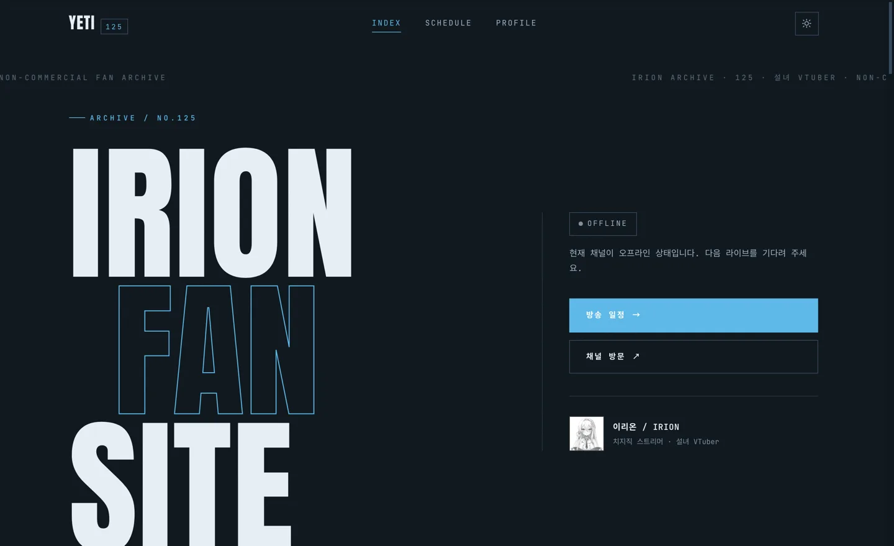

</div>

<br>

## 소개

YETI-125는 치지직 스트리머 이리온의 활동을 한곳에 모아 보여주는 팬 아카이브입니다.

chzzk API와 연동해 실시간 방송 상태를 보여주고,
인기 클립과 다시보기를 자동으로 수집하며,
관리자가 직접 등록한 방송 일정을 캘린더로 제공합니다.

> 순수한 팬 활동의 일환으로 제작된 비상업적 프로젝트입니다.
> 원 저작자와 직접적인 관련이 없으며, 정보 제공 및 아카이빙 목적으로만 운영됩니다.

<br>

## 기능

### 홈

실시간 방송 상태(LIVE / OFFLINE), 인기 클립과 다시보기,
채널과 SNS 링크를 한 화면에 정리합니다.

클립은 카드를 누르면 치지직으로 나가지 않고 그 자리에서 재생됩니다.
치지직 공식 임베드 플레이어를 모달에 띄우는 방식이라
조회수 집계와 시청 제한은 치지직 정책을 그대로 따릅니다.
새 탭으로 열고 싶으면 `⌘`(또는 `Ctrl`)를 누른 채 클릭하면 됩니다.

다시보기는 치지직이 임베드 경로를 제공하지 않아 링크 이동입니다.
나가기 전에 어디로 가는지 알리는 확인 모달을 띄웁니다.
매번 묻는 것이 번거로우면 "다시 묻지 않기"로 끌 수 있고,
끈 뒤에는 섹션 머리말에 되돌리는 링크가 나타납니다.
선택은 기기에 기억됩니다.

목록에서 감출 다시보기는 `LiveFeedService` 의 `HIDDEN_VIDEO_NOS` 에
`videoNo` 로 적어둡니다. 제목은 바뀔 수 있지만 번호는 그대로입니다.
지우는 것이 아니라 이 사이트에서만 가리는 것이라 치지직에는 남아 있습니다.

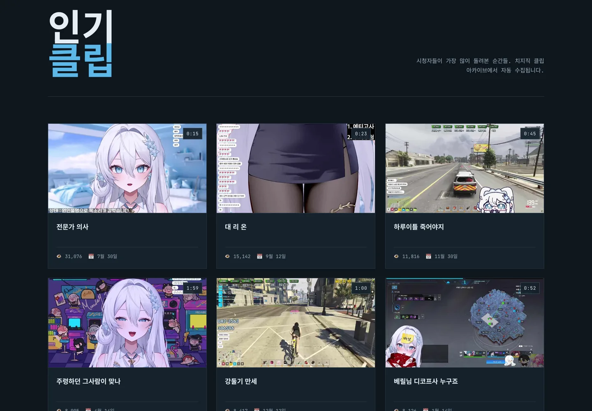

### 방송 일정

월간 캘린더 뷰로 방송 일정을 확인합니다.
저스트 채팅, 종합게임, 노래방송, 합방 — 유형별로 색을 달리해 한눈에 구분됩니다.

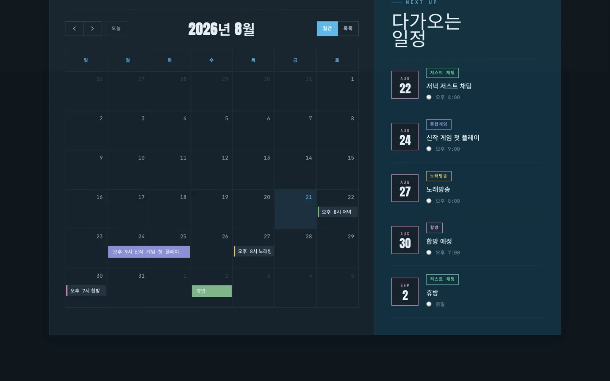

### 프로필

캐릭터 설정, 제작 크레딧, 데뷔일과 생일 D-Day,
채널과 SNS 링크를 정돈된 형태로 제공합니다.

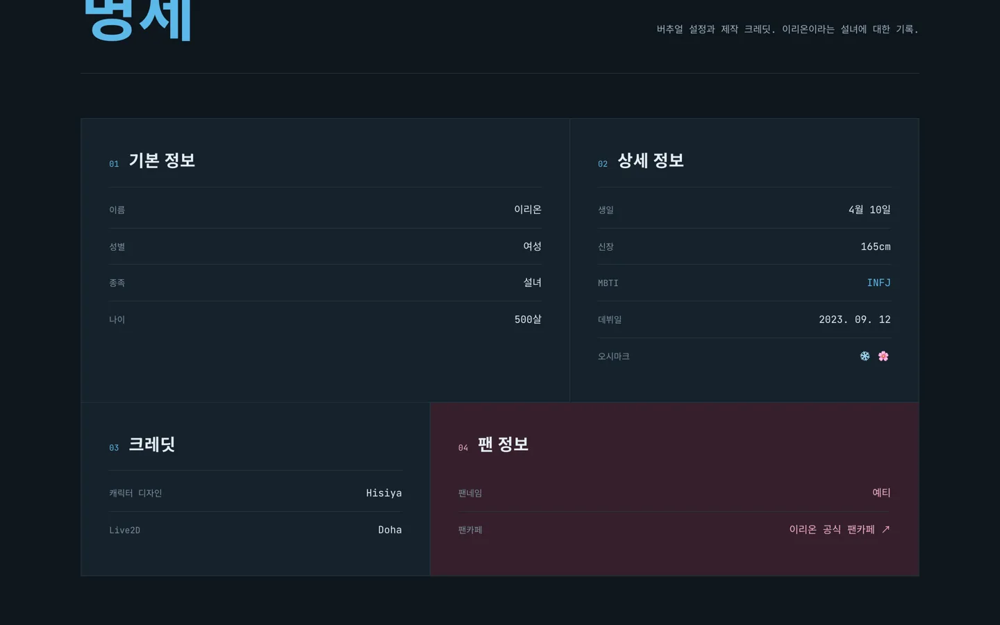

### 관리자

방송 일정을 등록·수정·삭제하고, 캘린더에서 드래그로 옮길 수 있습니다.
좁은 화면에서는 월간 격자 대신 목록 뷰로 시작해 제목과 시간을 그대로 읽을 수 있습니다.

인증은 필터와 인터셉터 두 겹으로 봅니다.
필터가 `DispatcherServlet` 앞에서 정적 페이지까지 막고,
인터셉터가 컨트롤러 진입 직전에 한 번 더 확인합니다.
두 곳 모두 AJAX 요청에는 리다이렉트 대신 401 을 돌려줍니다.

### 인트로

홈에 처음 들어오면 문이 열리는 연출이 재생됩니다.
하루에 한 번만 보여주므로, 같은 날 다시 방문하면 바로 본문이 나옵니다.
(마지막으로 문을 연 날짜를 `localStorage` 에 두고 오늘과 비교합니다)

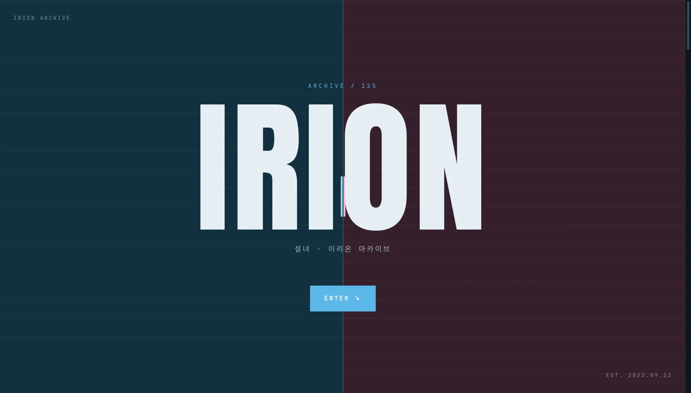

### 다크모드

상단바의 토글로 전환합니다.
선택은 기기에 기억되고, 고른 적이 없으면 OS 설정을 따릅니다.

<br>

## 기술 스택

| 영역 | |
|------|---|
| 백엔드 | Java 8 · Spring Framework 5.3 · MyBatis |
| 데이터베이스 | MariaDB · HikariCP |
| 프론트엔드 | HTML5 · CSS3 · JavaScript · jQuery 3.7 |
| 라이브러리 | FullCalendar 6.1 · Jackson · Hibernate Validator |
| 테스트 | JUnit 4 |
| 외부 API | [chzzk API](https://chzzk.naver.com/) · 클립 임베드 플레이어 |
| 빌드 / 서버 | Maven · Apache Tomcat 9 |

<br>

## 아키텍처

nginx가 HTTPS를 끊고 톰캣에 평문으로 넘깁니다.
방송 일정은 MariaDB에서, 라이브 상태·클립·다시보기는 치지직 API에서 옵니다.

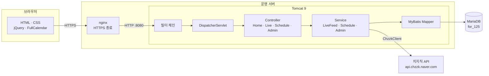

### 요청 처리 파이프라인

필터 다섯 개가 순서대로 지나갑니다. 순서는 `web.xml` 의 `filter-mapping` 선언 순입니다.

`adminLoginFilter` 가 `DispatcherServlet` **앞에서** 도는 것이 중요합니다.
정적 HTML까지 막아주는 대신, 인증 실패 응답을 이 필터가 직접 만들어야 합니다
(트러블슈팅의 "세션이 끊기면 관리자 캘린더가 에러도 없이 비는 문제" 참고).

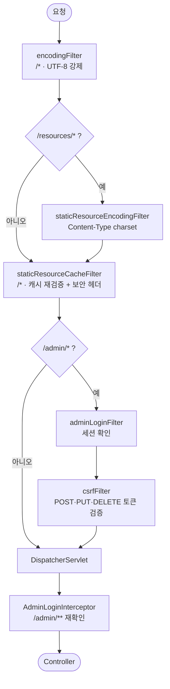

### 데이터 모델

테이블은 둘뿐이고 **서로 외래키로 엮이지 않습니다.**
일정에 작성자를 남기지 않기 때문입니다. 관리자가 한 명이라 지금은 필요가 없고,
여러 명이 되면 `tb_schedule` 에 `admin_id` 를 더하면 됩니다.

삭제는 `del_yn` 으로 표시만 하고 행은 남깁니다.

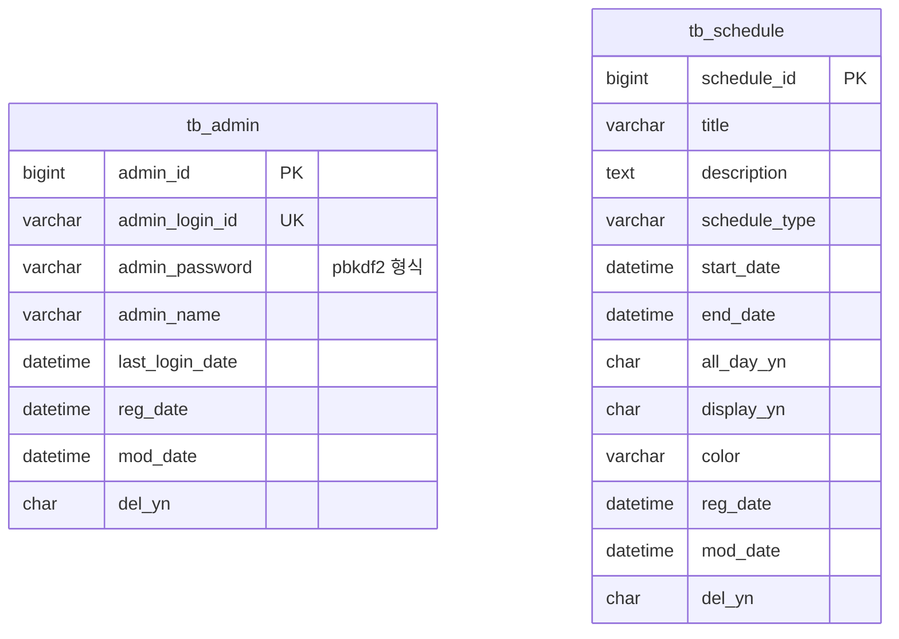

<br>

## 디자인

파스텔 라이트 테마와 다크 테마.
하늘색을 메인으로, 분홍을 포인트로 사용합니다.

색은 전부 CSS 커스텀 프로퍼티로 관리합니다.
다크 테마는 같은 토큰 이름에 야간 값을 덮어쓰는 방식이라,
각 페이지 CSS를 건드리지 않고도 전환됩니다.
어두운 배경에서는 액센트를 한 단계 밝혀 탁해 보이지 않게 했습니다.

타이포그래피는 디스플레이의 Anton과 본문의 JetBrains Mono를 대비시켜
정보의 위계를 만들었습니다.
화면 전체에 옅은 그레인 텍스처를 더해 무게감을 주고,
미디어 카드는 균일한 3열로 정렬해 가독성에 집중했습니다.

모바일에서는 터치 타깃을 44px 이상으로 확보하고,
입력창 글자를 16px로 두어 iOS 사파리의 자동 확대를 막았습니다.

<br>

## 보안

관리자 영역은 팬사이트 규모에 맞는 선에서 기본기를 갖춰두었습니다.

| | |
|---|---|
| 비밀번호 | PBKDF2-HMAC-SHA256 · 210,000회 반복 · 상수 시간 비교 |
| 세션 | 로그인 성공 시 세션 재발급 (세션 고정 방어) |
| 쿠키 | `HttpOnly` · `Secure` · `SameSite=Lax` |
| CSRF | 상태 변경 요청에 토큰 검증, 로그아웃은 POST |
| 무차별 대입 | 계정 기준 실패 횟수 제한 · 자동 해제 · 추적 항목 수 상한 |
| 계정 열거 | 아이디 존재 여부와 무관하게 같은 시간을 들여 응답 |
| 자원 남용 | 일정 조회 기간 상한 · 로그인 아이디 길이 상한 |
| 응답 헤더 | CSP · HSTS · `X-Frame-Options` · `X-Content-Type-Options` |
| 외부 스크립트 | jQuery · FullCalendar 에 SRI 해시 |

비밀번호 저장 포맷은 알고리즘 이름을 앞에 둡니다.

```
pbkdf2$210000$<salt>$<hash>
```

이 포맷으로 옮기기 전에는 SHA-256 을 한 번만 돌린 값을 저장했습니다.
두 형식을 한동안 같이 받아주면서, 로그인에 성공하는 순간 — 원문을 아는
시점이 거기뿐입니다 — 새 형식으로 다시 저장하는 방식으로 계정을 하나씩
옮겼습니다. DB를 한 번에 갈아엎지 않아도 되는 대신, 옛 형식을 검증하는
경로가 남아 있어야 했습니다.

계정이 모두 옮겨간 것을 확인한 뒤 그 경로는 지웠습니다.
옛 형식은 검증이 1ms도 걸리지 않아서, **그런 계정만 응답이 눈에 띄게
빨리 돌아왔기 때문입니다.** 지금은 알 수 없는 형식의 해시를 만나면
같은 시간을 들여 거절하고, 원인을 `ERROR` 로그로 남깁니다 —
그러지 않으면 화면에는 "비밀번호가 틀렸다"로만 보여 진짜 이유를
알아낼 방법이 없습니다.

반복 횟수를 올릴 때 기존 해시를 다시 만드는 경로는 그대로 있습니다.
`ITERATIONS` 를 높이면 다음 로그인부터 차례로 새 값으로 바뀝니다.

비밀번호를 몰라도 **응답 시간만 재면 아이디의 존재 여부를 알 수 있습니다.**
관리자 계정이 하나뿐이라 아이디가 드러나는 순간 표적이 확정되고,
위의 실패 횟수 제한과 엮이면 관리자를 계속 잠가두기도 쉬워집니다.
그래서 없는 아이디에도 검증에 드는 만큼의 계산을 그대로 씁니다.

| 로그인 실패 경로 | 응답 시간 |
|---|---|
| 있는 아이디 + 틀린 비밀번호 | 197.8 ms |
| 없는 아이디 | 199.2 ms |
| 알 수 없는 형식의 해시 | 196.6 ms |

CSP 의 `script-src` 에는 `'unsafe-inline'` 이 없습니다.
페이지에서 인라인 `onclick` 을 전부 걷어냈기 때문입니다.
닫기 버튼 하나를 인라인으로 되돌리는 순간 이 방어가 통째로 무의미해지므로,
새 핸들러는 `data-*` 속성과 이벤트 위임으로 붙입니다.

`SameSite` 는 Servlet 4.0 의 `<cookie-config>` 에 항목이 없어
`webapp/META-INF/context.xml` 의 톰캣 쿠키 처리기로 지정합니다.

인증 실패를 돌려주는 방식은 요청 종류에 따라 다릅니다.
AJAX에는 401 JSON을, 브라우저 요청에는 로그인 페이지 리다이렉트를 보냅니다.

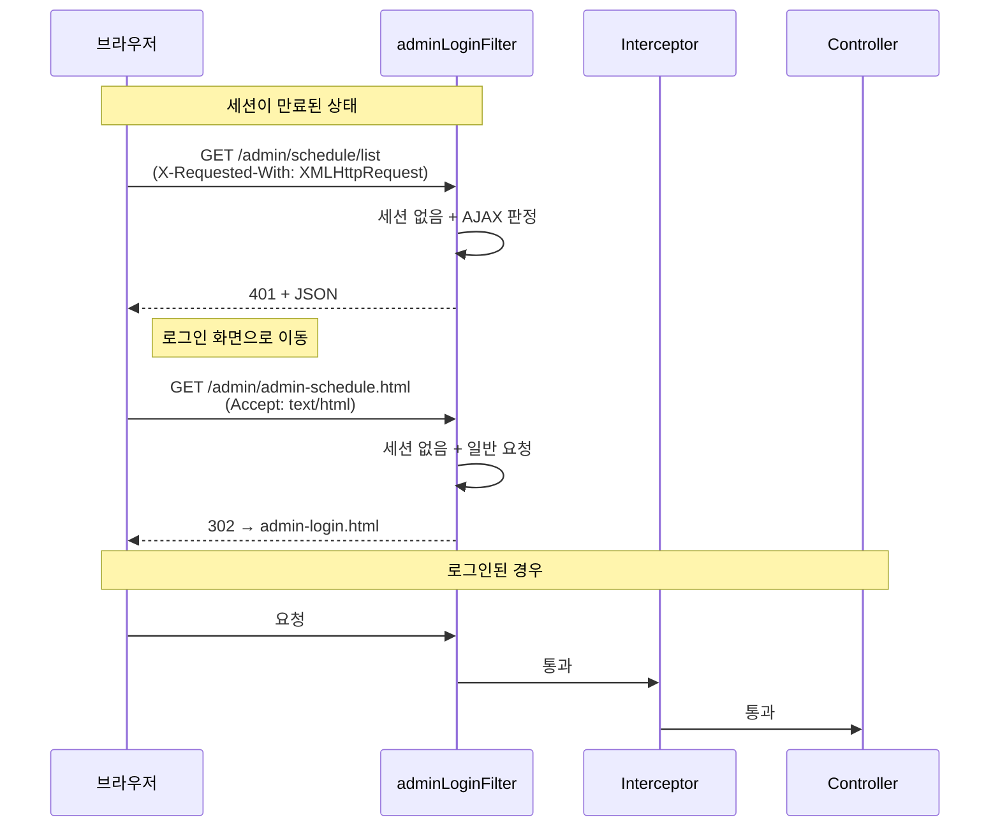

> `Secure` 때문에 로컬 `http://localhost:8080` 에서는 관리자 로그인이
> 사파리에서 유지되지 않습니다. 크롬과 파이어폭스는 localhost 를
> 신뢰할 수 있는 출처로 보아 그대로 동작합니다.

<br>

## 시작하기

JDK 8 이상, Maven 3.6 이상, MariaDB 10 이상, Apache Tomcat 9 이상이 필요합니다.

#### 1. 저장소 클론

```bash
git clone https://github.com/sooindev/YETI-125.git
cd YETI-125
```

#### 2. 데이터베이스 준비

`src/main/resources/sql/schema.sql` 을 실행해 `for_125` 데이터베이스와
`tb_admin`, `tb_schedule` 테이블을 생성합니다.

```bash
mysql -u root -p < src/main/resources/sql/schema.sql
```

#### 3. 접속 정보 설정

`src/main/resources/properties/database.properties` 에서 계정 정보를 수정합니다.
이 파일은 `.gitignore` 대상이라 저장소에 포함되지 않습니다.

```properties
db.driver=org.mariadb.jdbc.Driver
db.url=jdbc:mariadb://localhost:3306/for_125?useUnicode=true&characterEncoding=UTF-8&serverTimezone=Asia/Seoul
DB_USERNAME=your_username
DB_PASSWORD=your_password
```

#### 4. 빌드와 실행

```bash
mvn clean package
cp target/*.war $TOMCAT_HOME/webapps/ROOT.war
$TOMCAT_HOME/bin/startup.sh
```

HTML이 `/resources/...` 절대경로를 사용하므로 **ROOT 컨텍스트로 배포해야 합니다.**
`yeti-125.war` 그대로 두면 CSS와 JS가 404가 됩니다.

macOS에서는 위 과정을 스크립트 하나로 대신할 수 있습니다.
빌드 → 로컬 톰캣에 ROOT로 배포 → DB 연동까지 확인합니다.

```bash
./run-local.sh
```

DB 비밀번호는 스크립트에 두지 않습니다.
`~/.my.cnf` 의 `[client]` 섹션을 읽거나 `YETI_DB_PASSWORD` 환경변수를 받습니다.

```ini
[client]
password="비밀번호"
```

`my.cnf` 에서 `#` 는 주석 시작 문자입니다. 비밀번호에 `#` 가 들어 있으면
거기서 잘린 채 읽혀 원인을 짐작하기 어려운 `Access denied` 가 납니다.
값은 큰따옴표로 감싸세요. `user=` 는 넣지 않습니다 —
`[client]` 는 모든 mariadb 클라이언트에 적용되어 소켓 인증까지 끌려갑니다.

테스트는 빌드에 포함되어 있고 따로 돌릴 수도 있습니다.

```bash
mvn test
```

#### 5. 접속

| | |
|---|---|
| 메인 사이트 | `http://localhost:8080` |
| 관리자 | `http://localhost:8080/admin/admin-login.html` |

<br>

## 배포

`database.properties` 는 classpath 리소스라 **war 안에 그대로 패키징됩니다.**
로컬 설정이 담긴 war를 운영에 올리면 DB 연결에 실패해 사이트가 내려갑니다.

이를 막기 위해 빌드 프로파일을 분리했습니다.
운영 설정은 `src/main/resources-prod/properties/database.properties` 에 두고,
`prod` 프로파일로 빌드할 때만 덮어씁니다. 이 파일 역시 `.gitignore` 대상입니다.

```bash
mvn clean package          # 로컬 개발용
mvn clean package -Pprod   # 운영 배포용
```

운영 설정이 채워지지 않았거나 주소가 로컬을 가리키면 **빌드 단계에서 중단됩니다.**

배포는 스크립트 한 줄로 끝납니다.
빌드 → 전송 → 교체 → 검증 순으로 진행하고, 검증에 실패하면 직전 백업으로 자동 롤백합니다.

```bash
./deploy.sh
```

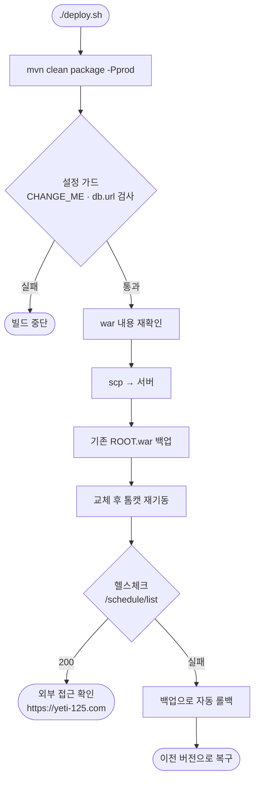

<br>

## 프로젝트 구조

```
YETI-125/
├── src/
│   ├── main/
│   │   ├── java/com/irion/
│   │   │   ├── common/
│   │   │   │   ├── controller/  HTTP 처리 (요청 파라미터 · 응답 모양)
│   │   │   │   ├── service/     ChzzkClient(호출·파싱) · LiveFeedService(캐시)
│   │   │   │   ├── filter/      인증 · CSRF · 보안 헤더 · 캐시 재검증
│   │   │   │   ├── interceptor/ 관리자 인증
│   │   │   │   └── util/        비밀번호 · CSRF 토큰 · 로그인 시도 제한 · 조회 기간
│   │   │   ├── schedule/      방송 일정 — controller / service / mapper
│   │   │   └── admin/         관리자 — 인증, 일정 관리
│   │   ├── resources/
│   │   │   ├── spring/        Spring 설정
│   │   │   ├── mybatis/       MyBatis 설정
│   │   │   ├── properties/    DB 접속 정보 (로컬)
│   │   │   └── sql/           스키마와 매퍼 SQL
│   │   ├── resources-prod/    DB 접속 정보 (운영) — mvn -Pprod 전용
│   │   └── webapp/
│   │       ├── META-INF/      톰캣 쿠키 처리기 (SameSite)
│   │       ├── WEB-INF/       web.xml · 오류 페이지
│   │       ├── resources/     css · js · images
│   │       └── *.html         홈, 일정, 프로필, 관리자
│   └── test/java/com/irion/   비밀번호 · 로그인 검증 · 시도 제한 · 일정 저장
│                              치지직 파싱 · 페이지네이션 · 입력 검증 · 조회 기간
├── docs/screenshots/      README 용 화면 캡처
├── run-local.sh           로컬 빌드 · 배포 · 기동 확인
├── deploy.sh              빌드 · 전송 · 배포 · 롤백
└── pom.xml
```

<br>

## 트러블슈팅

#### 일정 시간이 9시간씩 밀려 저장되는 문제

관리자에서 오전 8시로 등록한 일정이 DB에는 오후 5시로 저장되었습니다.
입력한 모든 시각이 정확히 9시간씩 어긋났습니다.

원인은 타임존 변환의 중복이었습니다.
프론트엔드가 오프셋(KST +9h)을 더해 UTC 형식으로 보냈고,
백엔드 `ScheduleVO`가 그 값을 다시 UTC 기준으로 해석하면서
KST 시각에 9시간이 한 번 더 더해진 것입니다.

변환 지점을 하나로 모았습니다.
프론트는 `datetime-local` 입력값을 변환 없이 그대로 보내고,
백엔드의 `@JsonFormat`을 `Asia/Seoul` 기준으로 해석하도록 변경했습니다.
입력·저장·표시 전 구간이 KST로 일관되게 맞춰졌습니다.

#### 직접 만든 JSON 파서가 제목을 잘라먹는 문제

인기 클립의 썸네일 자리에 이미지 대신 제목이 나오거나,
제목이 중간에서 끊겨 표시되었습니다.

chzzk 응답을 `indexOf` 로 잘라 읽는 파서를 직접 두고 있었습니다.
문자열의 끝을 다음 `"` 로 찾는 방식이라 JSON 이스케이프를 모릅니다.

```
입력   {"clipTitle":"이리온 \"레전드\" 순간"}
결과   이리온 \
```

괄호 매칭에 escape 판정을 덧대며 한동안 버텼지만,
`\n` · `\\` · `\/` 가 디코드되지 않는 등 같은 종류의 문제가 계속 나왔습니다.
JSON 을 직접 파싱하려 한 것 자체가 원인이었습니다.

이미 의존성에 있던 Jackson 으로 교체하고 손으로 만든 파서 120줄을 걷어냈습니다.
같은 작업에서 치지직 호출·파싱을 `ChzzkClient` 로, 캐시를 `LiveFeedService` 로
분리해 컨트롤러에는 HTTP 처리만 남겼습니다 (602줄 → 92줄).
회귀를 막으려고 위 입력을 그대로 테스트로 고정해두었습니다.

#### 페이지 스크롤이 중간에 멈추는 문제

리뉴얼 직후 일부 페이지에서 본문 중간까지만 스크롤되고 더 내려가지 않았습니다.

`body`에 가로 스크롤을 막으려고 `overflow-x: hidden`을 지정했는데,
CSS 명세상 한 축에 `hidden`을 주면 다른 축의 `overflow`가 자동으로 `auto`로 승격됩니다.
그 결과 `body`가 별도 스크롤 컨테이너가 되어 문서 스크롤과 충돌했습니다.

`overflow-x: hidden`을 `body`에서 `html`로 옮겨,
`body`는 일반 문서 흐름을 유지하도록 했습니다.

#### 배포 직후 사이트 전체가 응답하지 않는 문제

새 war를 올린 뒤 정적 페이지는 열리는데 DB를 읽는 요청마다 실패했습니다.
데이터가 지워진 것처럼 보였지만, 실제로는 연결 대상이 잘못돼 있었습니다.

`database.properties` 는 classpath 리소스라 빌드 시 war 안에 함께 들어갑니다.
로컬 개발 설정이 담긴 채로 패키징된 war가 배포되면서,
운영 서버가 존재하지 않는 로컬 주소로 접속을 시도한 것입니다.

빌드 프로파일을 분리해 운영 설정을 별도 디렉터리에서 주입하도록 했습니다.
설정이 비어 있거나 주소가 로컬이면 빌드 자체가 실패하므로,
잘못된 war가 만들어지지 않습니다.

#### 500 오류가 404 빈 화면으로 표시되는 문제

위 장애를 추적할 때 원인 파악이 늦어진 이유입니다.
`web.xml` 이 오류 페이지를 `/WEB-INF/views/common/500.jsp` 로 지정하고 있었는데
해당 파일이 없었습니다.

500이 발생하면 없는 페이지로 포워딩되고, 그 과정에서 404가 반환되며
본문이 비어 있어 원래 오류가 완전히 가려집니다.

404 · 500 페이지를 실제로 만들어 채웠습니다.

#### 수정한 CSS·JS가 반영되지 않는 문제

파일을 고치고 새로고침해도 예전 화면이 그대로 보였습니다.
강제 새로고침(`⌘⇧R`)을 해야만 반영되었습니다.

톰캣이 정적 파일에 `Last-Modified` 만 보내고 `Cache-Control` 을 보내지 않아,
브라우저가 자체 휴리스틱으로 캐시 유효기간을 정한 탓입니다.
배포 후 기존 방문자가 새 HTML과 예전 CSS를 섞어 받는 문제로도 이어집니다.

`StaticResourceCacheFilter` 를 추가해 `.html` · `.css` · `.js` 에
`Cache-Control: no-cache` 를 지정했습니다.
변경이 없으면 304만 오가므로 대역폭 부담은 거의 없습니다.

#### 다시보기는 임베드되지 않는 문제

클립과 같은 방식으로 다시보기도 사이트 안에서 재생하려 했으나 되지 않았습니다.
`/embed/video/{videoNo}` 를 `iframe` 에 넣으면 플레이어 대신
치지직의 "존재하지 않는 채널입니다" 화면이 나옵니다.

치지직 프론트엔드 번들의 라우터를 확인해보니
임베드 경로는 `/embed/clip/:clipUID` 와 `/embed/clip-donation/:clipUID` 둘뿐입니다.
VOD용 경로 자체가 없어서, 라우터에 걸리지 않고 SPA의 404로 떨어진 것입니다.
`X-Frame-Options` 나 CSP `frame-ancestors` 로 막는 방식이 아니라
(치지직은 이 헤더들을 아예 보내지 않습니다) 경로가 존재하지 않는 쪽입니다.

치지직이 임베드를 열어둔 범위가 클립까지라고 보고,
다시보기는 기존의 링크 이동을 유지했습니다.

#### 클립 더보기가 20개에서 멈추는 문제

더보기를 눌러도 클립이 스무 개를 넘지 않았습니다.
코드는 열 페이지를 돌며 최대 100개를 모으도록 짜여 있었는데도 그랬습니다.

chzzk 의 클립 페이징은 offset 이 아니라 커서입니다.
응답의 `page.next` 에 `clipUID` 와 `readCount` 가 함께 담겨 오고,
**두 값을 같은 이름의 파라미터로 되돌려줘야** 다음 묶음이 옵니다.
기존 구현은 `next` 라는 이름으로 `clipUID` 만 보냈습니다.
chzzk 은 모르는 파라미터를 조용히 무시하고 1페이지를 다시 줬고,
중복을 걸러내고 나면 늘 스무 개였습니다.
열 번 호출해 같은 스무 개를 열 번 받고 있었던 셈입니다.

커서를 `clipUID` + `readCount` 로 바로잡고, 미리 다 받는 대신
더보기가 요구하는 만큼만 이어 받아 캐시 뒤에 붙이도록 바꿨습니다.
목록이 자랄 때 적재 시각을 새로 찍어, 한참 넘겨보는 중에 TTL 이
끝나 목록이 처음부터 다시 쌓이는 일도 막았습니다.
메모리 상한과 요청당 외부 호출 횟수, 커서가 돌지 않을 때의 중단 조건을 함께 뒀습니다.

같은 자리에서 `paginate()` 의 경계 버그도 고쳤습니다.
`offset` 이 목록 길이를 넘으면 `subList` 가 예외를 던져
`/live/clips?offset=99999` 같은 요청이 500 이 됩니다.

정리된 흐름은 다음과 같습니다.
외부 호출은 락 밖에서 하고, 합치는 순간에만 락을 잡습니다.
한 스레드가 최대 10회 × 5초 동안 락을 쥔 채 나머지 요청을 세워두는 일을 막기 위해서입니다.

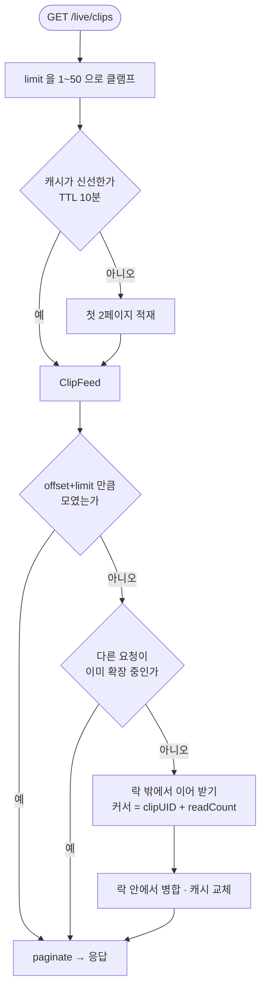

#### hidden 속성을 붙였는데 계속 보이는 문제

"이동 확인 다시 켜기" 링크를 `hidden` 으로 감췄는데도 화면에 남았습니다.
JS 로 속성을 붙이고 떼는 것은 정상이었습니다.

`hidden` 은 브라우저 기본 스타일시트의 `[hidden] { display: none }` 으로
동작합니다. 기본 스타일시트는 작성자 CSS 보다 우선순위가 낮아서,
그 요소에 `display` 를 지정하는 순간 숨김이 풀립니다.

`.aside-restore[hidden] { display: none; }` 로 명시적으로 다시 눌렀습니다.

#### 모달을 닫아도 클립 소리가 계속 나는 문제

클립 모달을 닫았는데 재생 중이던 소리가 멈추지 않았습니다.

`common.js` 의 공용 모달 로직은 배경 클릭과 ESC에 `.active` 클래스만 떼어냅니다.
화면에서 사라질 뿐 `iframe` 은 DOM에 그대로 남아 안쪽 플레이어가 계속 돕니다.
닫기 버튼만 따로 처리해서는 나머지 두 경로가 새어 나갑니다.

세 경로 모두에서 `iframe` 의 `src` 를 비우도록 했습니다.
`src` 를 지우면 문서 자체가 내려가므로 재생이 확실히 멈춥니다.

#### 모달 안에서 날짜 입력창이 밖으로 삐져나가는 문제

관리자 일정 등록 모달의 `datetime-local` 입력창이 모달 폭을 넘어
가로 스크롤이 생겼습니다. 입력창에 `width: 100%` 가 이미 지정돼 있었는데도
줄어들지 않았습니다.

입력창이 아니라 그리드 트랙이 원인이었습니다.
`datetime-local` 은 내부 UI 때문에 최소 폭이 크고,
`1fr` 트랙은 내용의 max-content 폭까지 늘어납니다.

`grid-template-columns` 를 `minmax(0, 1fr)` 로 바꿔 트랙을 묶었습니다.

#### 제목에 `'` 가 든 일정을 눌러도 아무 반응이 없는 문제

"다가오는 일정" 카드 중 일부만 클릭이 먹지 않았습니다.
콘솔에는 `SyntaxError` 만 찍혔습니다.

카드를 인라인 `onclick` 으로 만들면서 값에 `escapeHtml()` 을 통과시킨 것이
원인이었습니다. `escapeHtml` 은 `'` 를 `&#039;` 로 바꾸지만,
브라우저는 속성값을 **HTML 디코드한 뒤에** JS 로 파싱합니다.
그 시점에 아포스트로피가 되살아나 문자열 리터럴이 끊깁니다.

```
생성한 HTML    onclick="show('1', '이리온&#039;s 첫 합방')"
JS 가 보는 것   show('1', '이리온's 첫 합방')     ← SyntaxError
```

반대편도 문제였습니다. 상세 모달은 이미 이스케이프된 값을 다시 이스케이프하지
않고 `.html()` 에 넣어서, `<` 가 든 제목이 태그로 해석됐습니다.
한쪽은 너무 많이, 다른 쪽은 너무 적게 이스케이프하고 있었던 셈입니다.

인라인 핸들러를 없애고, 원본 객체는 배열에 둔 채 인덱스만 `data-*` 로 넘기도록
바꿨습니다. 이스케이프는 화면에 글자를 찍는 그 한 곳에서만 합니다.
이 정리 덕분에 CSP 의 `script-src` 에서 `'unsafe-inline'` 도 뺄 수 있었습니다.

#### 세션이 끊기면 관리자 캘린더가 에러도 없이 비는 문제

로그인이 만료된 뒤 관리자 페이지를 열면 일정이 하나도 없는 것처럼 보였습니다.
로그인 화면으로 넘어가지도, 오류를 띄우지도 않았습니다.

인증을 필터와 인터셉터 두 곳에서 보고 있었는데,
"AJAX 면 401" 분기는 인터셉터에만 있었습니다.
필터는 `DispatcherServlet` 앞에서 돌기 때문에 요청이 인터셉터까지 닿지 못하고
그 자리에서 로그인 페이지로 리다이렉트됩니다.

jQuery 는 302 를 그대로 따라가 로그인 HTML 을 200 으로 받습니다.
JSON 파싱에 실패해 `error` 콜백으로 오지만, 그때 `xhr.status` 는 200 이라
`401` 분기에 걸리지 않고 조용히 빈 배열로 끝납니다.
실패가 성공처럼 보이는 경로였습니다.

필터에도 같은 판정을 넣어 AJAX 요청에는 401 JSON 을 돌려주도록 했습니다.
판정 로직은 `RequestUtil` 한 곳에 모아 두 곳이 어긋나지 않게 했습니다.

<br>

## 라이선스

소스 코드는 [MIT License](LICENSE) 하에 배포됩니다.

방송 콘텐츠의 저작권은 원 저작자(이리온)에게 있으며,
chzzk, YouTube, X 등의 로고와 브랜드는 각 사의 상표입니다.

<br>

---

<br>

<div align="center">

**sooindev**

[github.com/sooindev](https://github.com/sooindev)

<br>
<br>

</div>
